# 1. Databricks Lakehouse Platform

## History | Data Lakehouse Overview

### Data Warehouses

- Data Warehouse came into existence in 1980s when business wants to gather all **operational data** in one place rather than looking in each individual department. Some large data warehouses also gather **external** data to make intelligent decisions.
- Data warehouses were built on _traditional relational databases_ (or _massively parallel processing_ (**MPP**) engines).
  - Data received mainly in **SQL tables**, **CSV files** or **semi-structured** (JSON, XML).
  - Then, go through the **ETL process** to go into Data Warehouses/Marts (**data marts** contain cleaned data). Then, consumed for analytics.
- However, in early 2000s, due to the popularity of the Internet, a significant increase in volumes of data + a change in variety of data (**unstructed** data such as vids, imgs, ...), but data warehouses are not able to handle these data. <br>
  Moreover, the data was only loaded after being extracted and transformed -> took longer to develop a solution to get new data into data warehouse. And it's expensive to store data (_high data storage cost_) and yet provides support for Data Science or ML/AI workloads.
  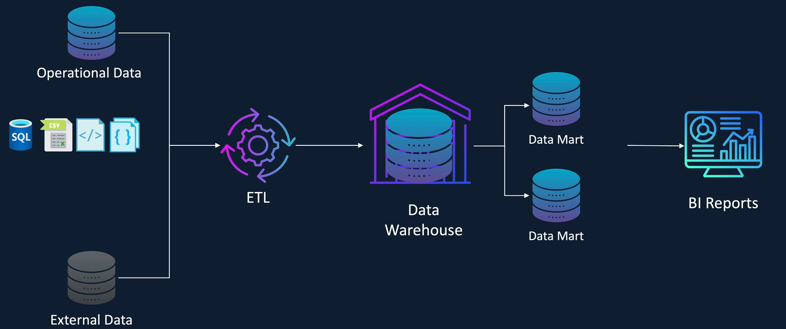

### Data Lake

- Data Lake came into existence around 2011.
- Not only handle **structured** and **semi-structured** data, but can also handle **unstructred** data
  - Raw data received is ingested into Data Lake **WITHOUT** any kind of cleansing or transformation -> result in quicker timescales to develop solutions as well as fast ingestion time.
  - Data Lakes were built on cheap storage solution like **HDFS** (_Hadoop Distributed File System_), **Amazon S3** or **ADLS Gen2** -> cost of storage is cheap -> ingest freely without much worrying
  - Support **Data Science** and **ML workloads** by providing access to the **raw data** as well as the **transformed data**
- However, there is a problem: Data Lakes are too slow to service **interactive BI reports**, and **lack of data governance**.

  Thus, companies often copy a subset of the data from the **Data Lake** to a **Warehouse** to support BI reporting, which led to a complex architecture with many moving parts.

  Also, Data Lakes have no support for ACID transactions and unable to handle corrections to data (i.e., rewrite the entire partition). No roll back any data being written (no history or versioning).

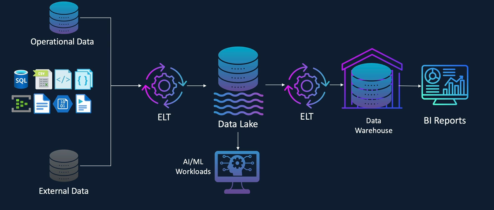

### Data Lakehouse

- Can ingest both **operational** and **external** data into a Data Lakehouse
- Data Lakehouse is basically Data Lake with `ACID` transaction controls, came to existence since 2018 and rapidly evolving with **data governance capabilities**.

  Data Lakehouse achieves this using the file format **Delta Lake** (offer ACID support -> sealessly combine streaming and batch workloads) and a data governance solution called **Unity Catalog**.  
  Additionally, the Lakehouse integrates with PowerBI and Tableau, while also providing role-based access control for governance.

## Introduction to Medallion Architecture

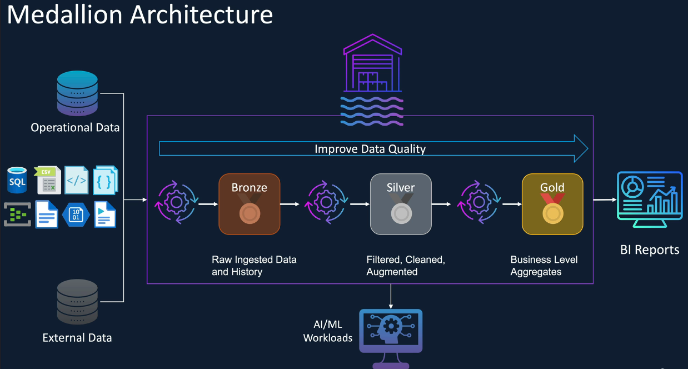

The data architecture used in Data Lakehouse is commonly referred to as **medallion architecture** (_data design pattern_).

- The **bronze layer** typically contains raw data as _received from various data sources_. At this layer, the data usually undergoes minimal to no transformation (at most some additional metadata, such as load, timestamp, or the name of the file maybe added for **tracking purposes**) -> crucial for auditing and identifying data issues.

  By not transforming the data, we can maintain a historical record of all the data received -> easily replay the data if any pipeline issues occur later.

- The **silver layer** (cleanup, validation) holds _filtered_, _cleansed_ and _enriched_ data with a _structure applied_ and _schema_ (either enforced or evolved) to **maintain consistency**.

  At this stage, the data undergoes **quality checks** to
  result in **structured**, **high quality** and **reliable** data, which is suitable for data science, machine learning and AI workloads.

  Operations performed in silver table (**enforce data quality**):

  - Remove invalid records
  - Standardize column values
  - Data deduplication
  - Remove/replace missing values
  - Schema enforcement
  - Type casting

- The **gold layer** contains business level `aggregated data`. Here, the data from the _silver layer_ is **further aggregated** and **enriched** with additional context to make it ready for **high level business reporting** and **analysis**.

  This layer is also used for advanced analytics and applications where needed.

### Example of medallion architecture

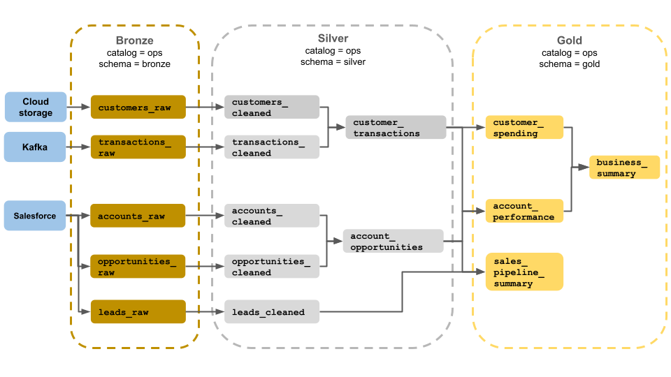

### Benefits of Medallion Architecture

- Improve **data lineage** and **traceability** of the data by moving the data through the clearly defined data layers of _bronze_, _silver_ and _gold_ -> easier to track **where the data has come from** and **how it is transformed** and **used** in applications.
- Enforce data governance and compliance policies such as GDPR.
- The design pattern allows for processing only **new and changed** data received at the Data Lakehouse -> support **incremental processing**.
- Give better control over security (e.g., defining **role-based access** control) to ensure only authorized user can access secure and sensitive data.

## Introduction to Databricks

- At the core of Databricks is the open-source distributed compute engine called **Apache Spark**.

  > Apache Spark is a fast, unified analytical engine designed for big data processing and ML; originally developed at UC Berkeley in 2009 and open sourced in 2010. It utilizes in-memory computing and various optimizations. **Spark** runs on a _distributed computing platform_ and has a _unified engine_ that supports both batch and streaming workloads.

- Databricks provides the **Spark runtime**, which is highly optimized for Databricks platform and known to be up to 5 times faster than the _vanilla Apache Spark_.
- Databricks also comes with a _vectorized query engine_ called **photon**, which provides extremely fast query performance up to 8 times improvement on the standard Databricks runtime.

## Databricks Architecture

- Consists of 2 main parts:
  - Control plane: handles all the backend services required for the Databricks platform
    - **Web user interface**: where users interact
    - **Cluster manager**: responsible for managing and provisioning compute resources when users create/interact clusters to scale them up/down.
    - **Unity Catalog**: provides _Data Governance_
    - **Storage for Queries & Code**: storing various workspace related metadata (e.g., notebooks and job run details).
  - Compute plane: where data processing takes place. It supports 2 types of compute
    1. `Classic` compute: Databricks directly provisions clusters within your subscription, which means the compute resources (VMs) are deployed and managed within your cloud.
    2. `Severless` compute: introduced in 2024. Databricks allocates resources from its pool of virtual machines already made available -> significantly reduces cluster startup time compared to classic compute, as the serverless model leverages the pre-allocated VMs within the Databricks subscription.
       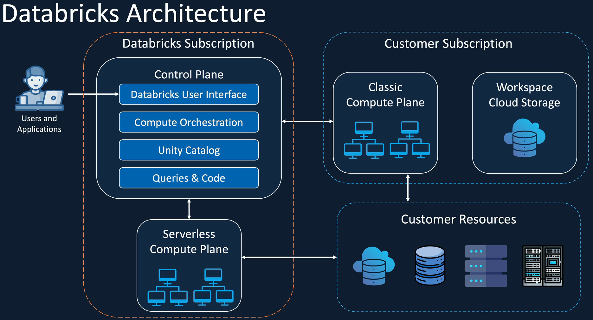

### Databricks Cluster

#### Cluster types

- A cluster is basically a collection of VMs, where each consists of a **Driver node** and (one or more) **Worker nodes**. <br>
  Clusters allow us to treat this group of computers as a **single compute engine** via the Driver node.

- There are 2 types of clusters:

|     |            All purpose             |             Job cluster             |
| :-- | :--------------------------------: | :---------------------------------: |
|     |          Created manually          |           Created by jobs           |
|     |             Persistent             |  Terminated at the end of the job   |
|     | Suitable for interactive workloads |  Suitable for automated workloads   |
|     |      Shared among many users       | Isolated just for the job workloads |
|     |          Expensive to run          |           Cheaper to run            |
|     |    -> Interactive analysis work    |     -> Repeated production work     |

#### Cluster Configuration

- `Single node` or `multi node`: Multi node will have one Driver node and (one or more) Workers node. Single node does not have Worker nodes, so only light-weight workload.

- `Access mode`: there are 4 types

  - **Single user**: only allows **a single user** to access the cluster. Supports Python, SQL, Scala, R.
  - **Shared**: multiple user access; provides process isolation -> each process gets its environment, so one cannot see the data nor credentials from the other.
  - **No isolation shared**: also allows the Cluster to be shared amongst more than one user. Different from the `shared` mode is that this does not provide any process isolation, thus failure in one user's process may affect the others. <br>
    Also, it does not offer any task preemption -> one running process may use up all the resources and the other may fail.

- Runtime: the set of core libraries that run on Databricks Clusters. There are 4 types:

  - Databricks runtime: includes an optimized version of Apache Spark library | Scala, Java, Python, R | Ubuntu libraries | GPU libraries | Delta Lake | other Databricks services
  - Databricks runtime ML: Databricks runtime + ML libraries (PyTorch, Keras, TensorFlow, XGBoost, ...)
    > Both of these runtimes also allows us to enable/disable `photon` - which is a vectorized query engine which accelerates Apache Spark workloads.
    > 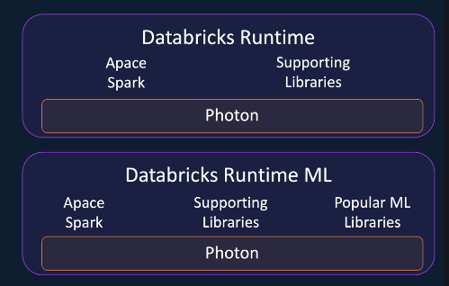

- Auto termination: avoid unnecessary costs on idle clusters (terminate cluster after _n minutes_ of inactivity)

  - Default value for Single Node and Standard clusters is 120mins.
  - Users can specify a value between 10 and 43200 mins as duration

- Auto scaling: automatically add/remove nodes from the Cluster depending on your workload. (users specify the min and max worker nodes)

  - Spot instances: the unused VMs or spare capacity in the cloud.

- Cluster VM Type/Size:

  - Memory Optimized: recommend for memory intensive applications. E.g., a ML workload that caches a lot of data in memory.
  - Compute Optimized: useful for structured streaming applications, where you need to make sure that the processing rate is above the input rate at peak times of the day.
  - Storage Optimized: recommended for use cases requiring high disk throughput and I/O.
  - General Purpose: recommended for Enterprise applications and analytics with in-memory caching.
  - GPU Accelerated: recommended for Deep Learning models which are data and compute intensive.

- Cluster Policy (_only available in Premium Tier_): Administrators can create policies with restrictions, and assign them to users/groups -> achieve cost control by limiting the maximum size of clusters.

## Unity Catalog

- Similar to Hive - Metadata Store, `Unity Catalog` also allows us to create tables and views on structured data.
  We can also create functions to abstract transformation logic as required.
- Unity Catalog offers another object, called `volume`, which is an abstraction layer on top of the files in the cloud storage -> it's the recommended approach for reading and writing the files in Lakehouse (especially files containing unstructured data).

### Unity Catalog Object Model

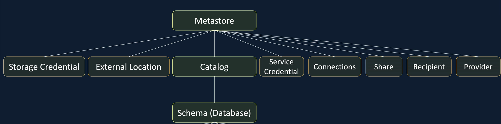

- **Metastore**:
  - Lives at the Databricks account level
  - Can only create `ONE metastore per Azure region`
  - Can be paired with default ADLS Storage
- **Storage Credential** and **External Location**: allow us to access a cloud storage or a data lake other than the default storage attached to the Metastore.
- **Service Credentials**: are used to hold the credentials of external cloud services altogether.
- **Connections**: represent credentials that give readonly access to an external database in a database system, such as MySQL or PostgreSQL. You can then access the database using the connection you've stored within Unity Catalog.
- **Share**, **Recipient**, **Provider**: handle Delta sharing.

#### Catalog

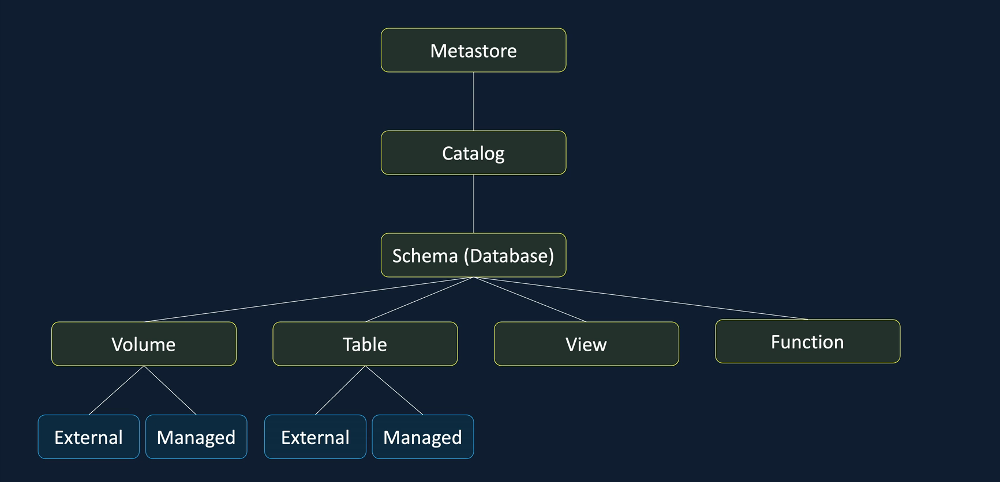

- A logical container within the Metastore to organize the datasets
- Each catalog may contain one or more `schemas (databases)`. One schema may contain one or more volumes, tables, views and functions.

  - (Logical) volume: high level abstraction to the containers. Can create both **managed** and **external** volumes.

    - Managed volumes: are fully managed by Unity Catalog, which means that Unity Catalog manages access to the volume via Unity Catalog when you are in Databricks, as well as via the Cloud Provider account (e.g., Azure).
    - External volume: represent existing data in the cloud storage that's managed outside of Databricks but registered in Databricks Unity Catalog, so that Catalog can control access to the storage via Databricks.
      <br>
      This is typically used for **containers** in which we receive data from external applications other than Databricks, but we want to use that data in Databricks.

  - Table: a collection of data organized by rows and columns. **Note:** all _managed_ tables in Unity Catalog are delta tables; you need to use _external_ tables to create a table with a format parquet, CSV, JSON.
    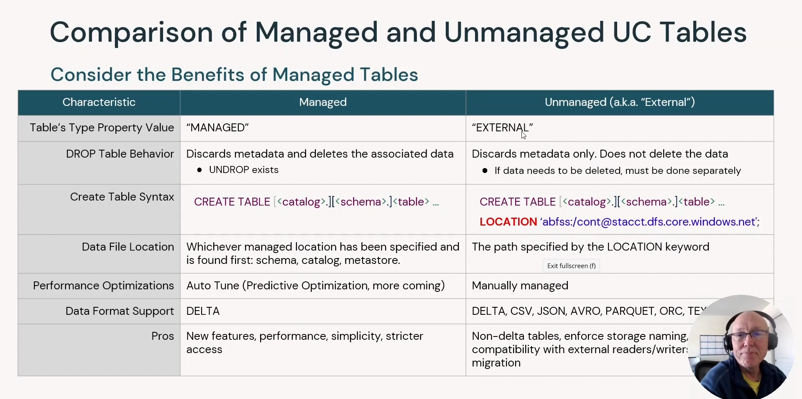

### Unity Catalog Set up

- Login to Databricks Account Console at [https://accounts.azuredatabricks.net](https://accounts.azuredatabricks.net) and User must have `Global Administrator Prvileges`. Otherwise, you have to create `Unity Catalog Metastore`.
- Usually, **Catalog** is already created by default. If not, create a metastore and attach Databricks workspace into it.
- Invoke the command in Databricks to check:
  ```sql
  SELECT CURRENT_METASTORE()
  ```
-
- If not, create a new user:
  - Navigate to Azure Portal -> Microsoft Entra ID -> `Mange` on the left tab -> `Users` -> `New user` -> `Create new user`
  - Fill in the information
  - After having created, click on that user -> on the left tab, click `Assigned roles` -> `Add assignments` -> search for `Global Administrator` -> click `Add`
  - Use this user to login databricks
  - In Databricks, go to `Catalog` on the left tab -> `Create metastore`
    > **Note:** the metastore and the workspace must be in the SAME REGION.
  - Then, you will have to assign to the workspace: choose the workspace that you want to assign -> click `Assign`

### Configure access to Cloud Storage

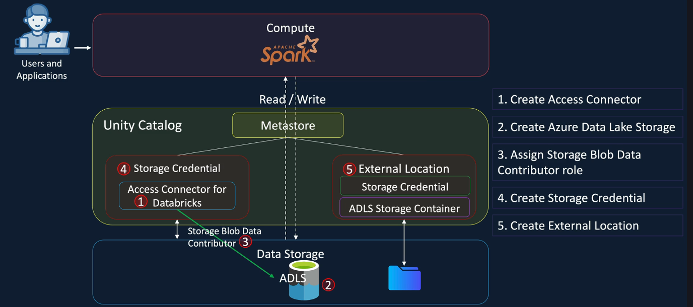

#### 1. Create access connector

- First, go to Azure Portal -> Create a resource -> Search for `access connector for azure databricks` -> Create

#### 2. Create ADLS gen 2 and 3. Assign contributor role

- Create as usual; remember to enable hierarchical namespace.
- Add role as `Data Contributor` -> then, assign access to **Managed Identity** -> `Select members` -> choose _Managed identity_ -> choose the connector that we created in step 1. -> `Review and Assign`
  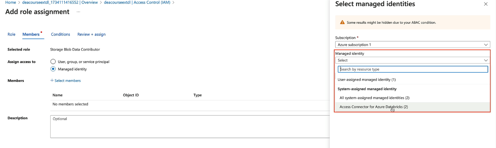

#### 4. Create storage credential
- After having created the storage, you are likely not able to access due to *Invalid configuration value detected for fs.azure.account.key*. Therefore, you need to create `External location` to be able to access that container location.

```sql
CREATE EXTERNAL LOCATION IF NOT EXISTS <storageaccountname_containername>
    URL url_str
    WITH (STORAGE CREDENTIAL <credential_name>)
    COMMENT <comment>
```
