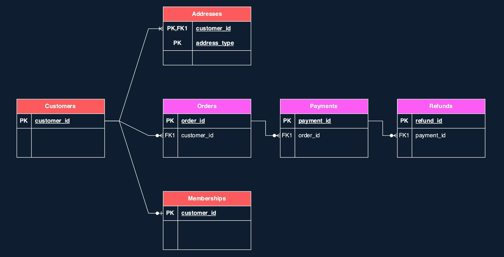

# 2. ETL with Apache Spark

## Set-up the environment

**Structure of the dataset:**


- _Operational data:_
  - addressess folder: contains `.tsv` file; format name: `addresses_<year>_<month>.tsv`
  - customers: contains `.json` file; format name: `customers_<year>_<month>.json`
  - memberships: contains images `.png`;
    format name: `<year>_<month>/{customer_id}.png`
  - orders: contains `.json` files
- _External data:_
  - payments: contains .csv file
  - refunds are made available in Azure SQL Database

## Querying data

### Commands using Catalogs

```sql
SHOW CATALOGS;

SELECT CURRENT_CATALOG();

USE CATALOG <name>;
```

```sql
CREATE CATALOG IF NOT EXISTS gizmobox
MANAGED LOCATION '<url to the location>' -- external location
```

Volume basically gives you an easy way of referencing your files

```sql
CREATE EXTERNAL SCHEMA/VOLUME
```

To select the file, we can do as below. Additionally, we can use wildcards (as regex).

```sql
SELECT * FROM <file_format>.`<file_path>`
```

To select the metadata:

```sql
SELECT _metadata.<option>
```

To create (temporary) views, however, note that temporary views are NOT in Data Catalog but rather a concept in Spark. When Spark session ends, temp views are destroyed, while global tmp view are destroyed when the cluster is terminated.

```sql
CREATE OR REPLACE (GLOBAL TEMPORARY) VIEW <view_name>
AS
  SELECT *
  FROM ...

-- in catalog
CREATE OR REPLACE VIEW <catalog>.<schema>.<view_name>
...
```

### Extract `Orders` data (complex JSON)

### Extract `Membership` data (images)

- Use binaryFile to process this data

### Extract `Address` data (.tsv file)

```sql
SELECT *
FROM read_files('<url>',
                format => 'csv',
                delimiter => '\t',
                header => true);
```

### Extract `Payments` data (.csv file)

- Create External Tables:

```sql
CREATE TABLE <catalog.schema.table_name>
(
  <list of column_names> <column_types>
)
USING <file format>
OPTIONS (
  ...
)
LOCATION "<file_path>"
```

- Update the lastest state (in case you modify the external storage and it hasnt been updated in your external table yet)

```sql
REFRESH TABLE <table_name>
```

### Extract `Refunds` data (via external table)

- Using SQL Database (must create first)
  - Unity Catalog doesn't allow you to use JDBC to connect to external databases. You need to use **Hive Metastore** instead. <br>
    If you want to work with Unity Catalog, you must use Lakehouse Federation.

1. Create bronze schema in Hive Metastore

```sql
CREATE SCHEMA IF NOT EXISTS hive_metastore.bronze
```

2. Create external table

```sql
CREATE TABLE IF NOT EXISTS hive_metastore.bronze.refunds
USING JDBC
OPTIONS (
  url '', -- achieve from sql db in portal
  dbtable '<table_name>',
  user '<username>',
  password '<>'

)
```

## Transformation

### Data profiling

```python
dbutils.data.summarize(df)
```

### Transform `Customers` data

\_To create CTE + cast the data types:

```sql
WITH cte_max AS
(
  SELECT customer_id,
          MAX(created_timestamp) AS max_created_timestamp
  FROM v_customers_distinct
  GROUP BY customer_id
)
SELECT CAST(t.created_timestamp AS TIMESTAMP) AS created_timestamp,
      t.customer_id,
      t.customer_name,
      CAST(t.date_of_birth AS DATE) AS date_of_birth,
      ...
FROM v_customers_distinct t
JOIN cte_max m
  ON t.customer_id = m.customer_id
  AND t.created_timestamp = m.max_created_timestamp;
```

### Transform `Payments` data

```sql
SELECT payment_id,
       order_id,
       date_format(payment_timestamp, 'yyyy-MM-dd') AS payment_date,
       ...
FROM gizmobox.bronze.payments;
```

### Transform `Refunds` data

\_Extract specific portion of the string:

```sql
SELECT refund_id,
       ...
       SPLIT(refund_reason, ':') -- return an array
FROM hive_metastore.bronze.refunds;


-- alternative (using regex)
SELECT regexp_extract(refund_reason, '^([^:]+):', 1) AS refund_reason
```

### Transform `Addresses` data

\_Using `PIVOT` -> going from rows to columns:

```sql
SELECT *
FROM (
    SELECT <group_column>, <pivot_column>, <value_column> -- pick the columns you'll work with
    FROM <your_table>
)
PIVOT (
    <aggregation_function>(<value_column>)
    FOR <pivot_column> IN (<value1> AS <alias1>, <value2> AS <alias2>, ...)
)

```

Explain:

- aggregate function (e.g., `SUM(sales)`): ell SQL how to combine multiple rows when they get mapped into a single cell in the pivot table.
- `FOR <pivot_column> IN (...)`: tell SQL which values of `pivot_column` should become columns
- `<value1> AS <alias1>`: says that a row with `pivot_column` = `value1` will become a column called `alias1`.

### Transform `Orders` data (string to JSON)

\_Using `regexp_replace()`
\_Using `from_json()`:

```sql
SELECDT from_json(fixed_value,
                'STRUCT<customer_id: BIGINT, items: ARRAY<STRUCT<category:        STRING, ...>>,
                ...') AS json_value

```

\_Using `explode`:

```sql
SELECT explode(array_distinct(json_value.items)) AS item
FROM ...
```

## User Defined Functions (UDFs)

- Should be divided into 3 namespace

```sql
CREATE OR REPLACE FUNCTION catalog_name.schema_name.udf_name(param data_type)
RETURNS return_type
RETURN expression; -- return value
```

Example:
```sql
CREATE OR REPLACE FUNCTION gizmobox.default.get_payment_status(payment_status INT)
RETURNS STRING
RETURN CASE payment_status
  WHEN 1 THEN 'Success'
  WHEN 2 THEN 'Pending'
  WHEN 3 THEN 'Cancelled'
  WHEN 4 THEN 'Failed'
  END;
```

## High order functions 
### Array functions (transform, filter, exists, aggregate)
- syntax: `<function_name> (arr_column, lambda_expression)` where `lambda_expression = "element -> expression"`
  - E.g., `TRANSFORM(items, x -> UPPER(x))` 

### Map (transform_keys, transform_values,)
```sql
SELECT 
  TRANSFORM_VALUES(item_prices, (item, price) -> ROUND(price*1.1, 2)) AS prices_with_tax
```