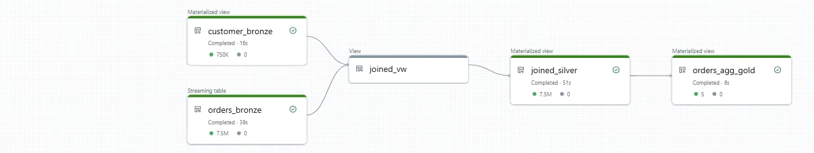
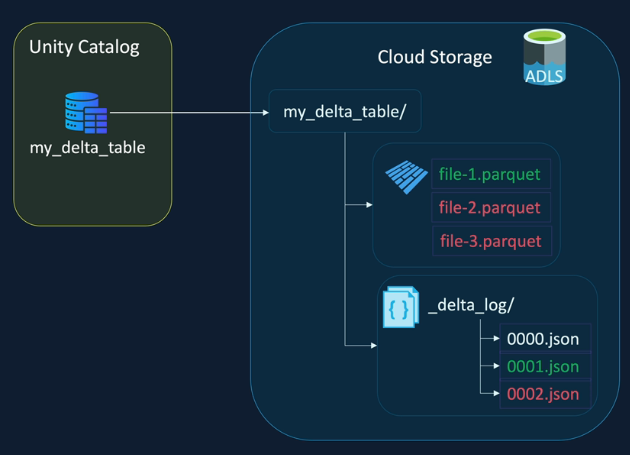
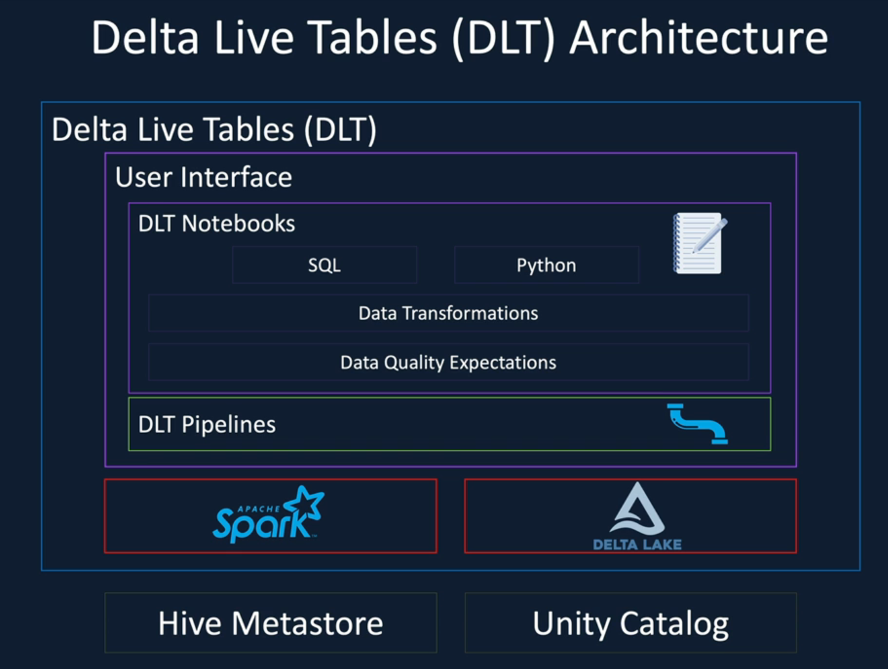

# 3. Incremental Data Processing

## Structured Streaming

### Demo

```python
customers_df = spark.readStream
                      .format("json")
                      .schema(customers_schema)
                      .load("path/to/file")
```

### Write transformed data stream to Delta Table

\_Once the streaming query is executed, we need to stop it manually OR set the params to stop after several iterations.

```python
streaming_query = customers_transformed_df.writeStream
                          .format("delta")
                          .option("checkpointLocation", "<unique_location>")
                          .toTable("<location_to_store>")

streaming_query.stop()
```

### Modify the interval and output

\_To specify the iterations and output mode:

```python
customers_transformed_df.writeStream
                        .format("delta")
                        .outputMode("append")
                        .trigger(processingTime="2 minutes")
                        .option(...)
                        .toTable(...)
```

### Checkpointing

- Stores metadata about streaming query, execution plan
- Tracks processed offsets and committed results

When a batch starts, Spark first reads the `offset log` to get the **start** and **end** offset of the previous batch. It's the `write-ahead log` which is written at the beginning of the batch, so there is no guarantee that the data from the batch was successfully processed.

In order to find that, Spark then reads the `commit log`: if the batch id is in the `offset log` matches with the `commit log`, then that indicates that the previous batch succeeded. Spark starts reading from the end offset of the previous batch.

Otherwise, Spark rereads the data from the start offset of the previous batch. Additionally, Spark also offers once guarantees -> avoid duplication.

### Auto Loader

\_To use AutoLoader:

```python
customers_transformed_df.readStream
                        .format("cloudFiles")
                        .option("cloudFiles.format", "json")
                        .option("cloudFiles.useNotifications", "true") # cloud storage services (e.g., AWS, S3, ...)
                        .schema(...)
                        .load(...)
```

## Delta Lake

### Delta Transaction Log



Let's say, first we created a `Delta Table` in `Unity Catalog`, and it also creates a folder in Cloud Storage to store the **file** and the **transaction log**.

Then, **Transaction 1 - Insert Data**, **Transaction 2 - Insert more data**, these transaction logs give Delta Lake the ability to offer ACID transactions as well as time travel capabilities.



### Delta Lake Version History

\_To query the table history:

```sql
DESCRIBE HISTORY <table_name>
```

\_To query data from a specific version:

```sql
SELECT *
FROM ...
VERSION AS OF 1;

-- or use the timestamp
SELECT *
FROM ...
TIMESTAMP AS OF '<the_specific_timestamp>';

```

\_To restore the version:

```sql
RESTORE TABLE <table_name>
VERSION AS OF 1;

```
### Delta Lake ACID Transactions
- Firstly, the **Transaction Logs** only return at the end of the transaction. E.g., when you insert data into the table, data files will be return first and only AFTER successful completion of writes in the data files, the **Transaction logs** will be written -> transaction logs become the single source of truth.
- When reading the data files, Delta Lake will read the **Transaction logs**, therefore it will not read the corrupted files (since the **transaction logs** won't be created).

### Create - Drop table 
- `CREATE OR REPLACE` retains all the transaction history, whereas `DROP` and then `CREATE` the table removes all of that history. -> should use create/replace to retain the history. 

### Delta Lake Table & Column properties
_To see the comment of a table:
```sql
DESC EXTENDED <table_name>
```

_`TBL properties` (table properties): used to specify table level metadata or configuration settings.
```sql
CREATE TABLE <table_name>
(...)
TBLPROPERTIES ('sensitive' = 'true'); -- can also change table configs
```

_To create the **column properties**:
```sql
CREATE TABLE <table_name>
(company_id BIGINT NOT NULL GENERATED ALWAYS AS IDENTITY (START WITH 1 INCREMENT BY 1),
...)

```
When using the clause `GENERATED BY DEFAULT AS IDENTITY`, insert operations can specify values for the identity column. Modify the clause to be `GENERATED ALWAYS AS IDENTITY` to override the ability to manually set values.

_**CTAS (Create Table As statement)**: a single operation 
```sql
CREATE TABLE <table_name> AS
(
  SELECT *
  FROM ...
  WHERE ...
)
```
Drawbacks: you **CANNOT** specify the columns properties; if you want to define the column data types, then it must be done in the **SELECT** statement. OR, you need to alter the table after creation. 

```sql
ALTER TABLE <table_name>
ALTER COLUMN <col_name> TYPE BIGINT
```

### Insert Overwrite and Partitioning 
- **Insert Overwrite**: overwrites the **existing** data in a table or a specific partition with the new data. 
- **Insert Into**: appends new data 

_If we want to insert overwrite the partitions in different tables:
```sql
INSERT OVERWRITE TABLE <table_partition_name>
PARTITION (country="USA")
SELECT ...
FROM <table_from_usa>
```

> Handle schema changes 
<br> - **Insert Overwrite**: Use to overwrite the data in a table or a partition when there are no schema changes. 
<br> - **Create or replace** table: use when there are schema changes.

### Copy into and Merge 
_Copy into (incrementally load new files from Cloud Storage into Delta table):
```sql
COPY INTO <table_name>
FROM 'path/to/file'
FILEFORMAT = JSON
FORMAT_OPTIONS ('inferSchema' = 'true')
COPY_OPTIONS ('mergeSchema' = 'true') -- if a new column is found, just add into the table
```
<br>
_Merge into: merge the source data into target table

```sql
MERGE INTO <target_table> AS target
USING <source_data> AS source
ON <tgt.id = src.id>
WHEN MATCHED AND source.status ='ACTIVE' THEN
  UPDATE SET 
    target.price = source.price,
    target.trading_date = source.trading_date

WHEN MATCHED AND source.status = 'DELISTED' THEN 
  DELETE 

WHEN NOT MATCHED THEN
  INSERT (...) VALUES (...);

```

### Delta Lake Compaction
_File compaction using `OPTIMIZE`: merge multiple small files into fewer, larger files. The history is still maintained. 
```sql
OPTIMIZE <table_name>
```

_File compaction using `ZORDER BY`: the data with specific z-order column values are kept together in the same file. -> optimize by searching through fewer data files.
```sql
OPTIMIZE <table_name>
ZORDER BY <column_name>
```

### Vacuum command 
- Used to removed, unused files from Delta Lake to free up storage. <br> E.g., when executing `OPTIMIZE`, the files are compacted into a larger file, leaving redundant smaller files.
- This command permanently removes data from the cloud storage, and it removes the files which are not referenced in the latest transaction log and older than the retention threshold (by default 7 days).

```sql
SET spark.databricks.delta.retentionDurationCheck.enabled = false; -- (optionally) disable the warning
VACUUM <table_name> RETAIN 1 HOURS; -- leave history for the last hour and delete files before that
```


## Delta Live Table
What is Delta Live Table?
- A declarative ETL framework for building reliable, maintainable, and testable data processing pipelines. 
- You define the transformation to perform on your data and Delta Live Tables manage task orchestration, cluster management, monitoring, data quality and error handling. 

