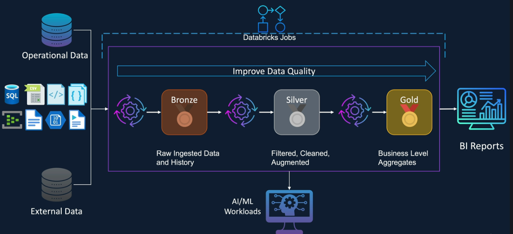
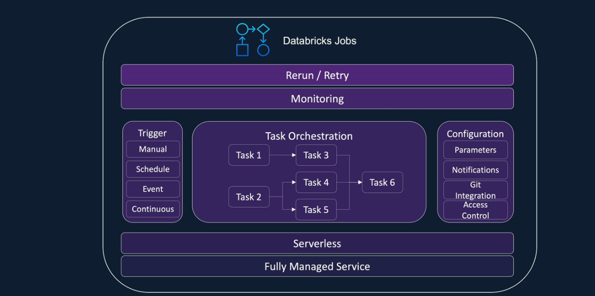
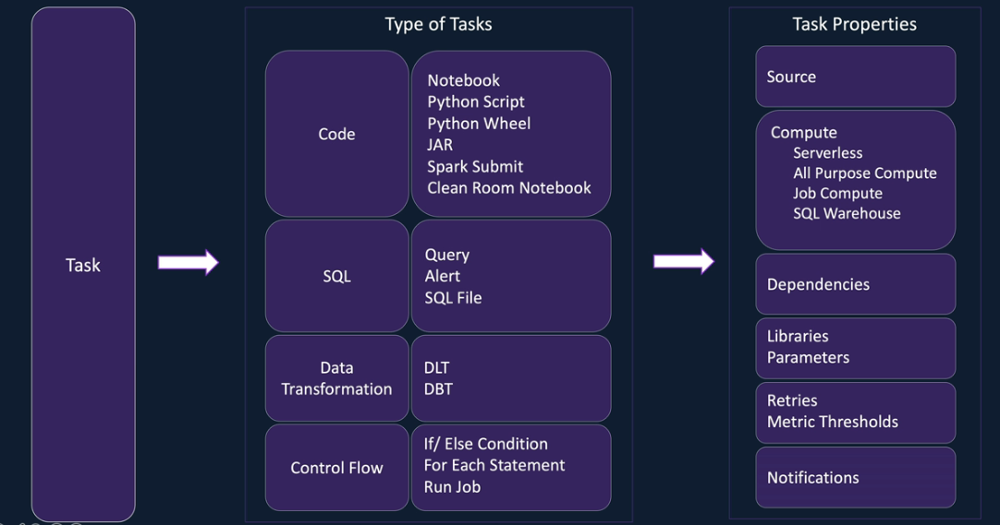
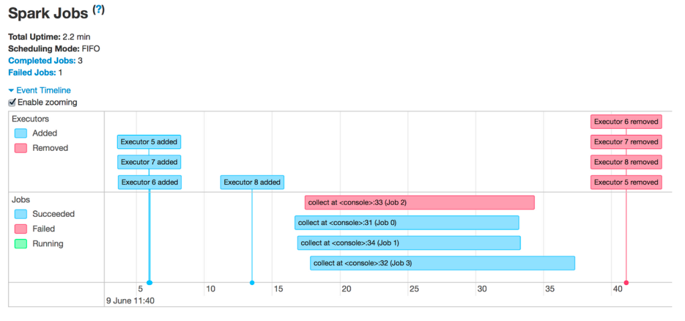
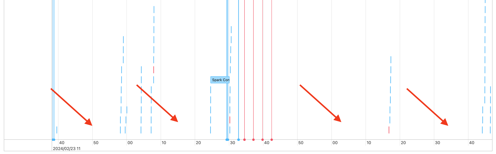
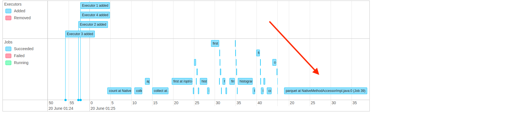

# 4. Production Pipelines

## Databricks Workflows/Jobs


Databricks Workflows is a **fully managed** orchestration service, fully integrated with the Databricks Data Intelligence Platform. 

It helps you 
- define a trigger for the pipeline based on the events
- create dependencies between the tasks so that they are executed in the required order
- also send notifications in the event of failure.



Inside a specific **Job**, in **Job notification**, we can add `Metric threshold`.
- `Run duration` (duration metric): expected and maximum time for the run's completion
- `Streaming backlog (bytes)` [streaming metrics]: expected maximum bytes of unconsumed data across all streams. 
- `Streaming backlog (duration)` [streaming metrics]: expected maximum consumer delay across all streams. 
- `Streaming backlog (files)` [streaming metrics]: expected maximum number of outstanding files across all streams. 
- `Streaming backlog (records)` [streaming metrics]: expected maximum offset lag across all streams. 

Additionally, we can configure the `Job parameters`, `Job notifications` (to receive alert via email, etc) and `Edit permissions`.

## Introduction to Tasks
A job will have a number of different `tasks`. And each task will be in its own type and has its own properties. 

This procedure is similar to working with `DAGs in Airflow`.


> A **job cluster** will do its job and after having finished, the cluster is terminated. And it's also less expensive than the **all purpose cluster**.

## Scheduling and Trigger 
> You can schedule in an **advanced mode** with `cron syntax`. Refer to [crontab generator](https://crontab.guru/) for more detail. 


## Databricks Asset Bundles (DAB)
This is the modern `Infrastructure as Code` (IaaC) approach for Databricks. A DAB project is defined by a **YAML configuration file** (`databricks.yml`). 
<br> This file declares all the assets of a project—notebooks, Python files, jobs, pipelines, cluster definitions, etc..., and their settings.

To init a project (using Databricks CLI), we type in 
```
databricks bundle init
```
, then provide our desired project name -> DAB project will be initialized in our folder. 

In `databricks.yml`, it includes the elements:
- `bundle`: define the name, uuid of the bundle
- `include`: reference to other shared .yml files (e.g., for reusability across environments). These .yml files can contain `resources` which runs the jobs and tasks, or even the pipelines.
- `targets`: maps the project to Databricks workspaces and environments: `dev`, `test`, `prod`

Navigate to the project's folder, then type in 
```bash
databricks bundle validate -t dev 
```
to validate our environment `dev`

Next, we **deploy the bundle** (only push our bundle to workspace) by using 
```
databricks bundle deploy -t dev
```

In order to **start the bundle** (run the jobs), type in 
```
databricks bundle run <job_name> -t dev
```

### Structure example
In `databricks.yml`:
```yml
bundle:
  name: my_dab_project
  uuid: ...

include:
  - resources/*.yml

targets:
  dev:
    mode: development
    workspace:
      host: <link to workspace>

  prod:
    mode: production
    workspace:
      host: <link to workspace>
    permission:
      - user_name: khanh
        level: CAN_MANAGE
```

In `./resources/my_dab_project.job.yml`:
```yml
resources:
  jobs:
    my_dab_project_job:
      name: my_dab_project_job

      trigger:
        periodic:
          interval: 1
          unit: DAYS

      tasks:
        - task_key: notebook_task
          job_cluster_key: job_cluster
          notebook_task:
            notebook_path: ../src/notebook.ipynb
```

## Debugging with Spark UI 
To access `Spark UI`, go to `Compute` then choose the tab `Spark UI`.

### Jobs and Timeline
The sections explain how to read the event timeline to discover the possible cause of your performance or cost issue. For more info, refer to [Debugging with Spark UI](https://docs.databricks.com/aws/en/compute/troubleshooting/debugging-spark-ui).

To access, click on **Jobs** and **Event Timeline**.

#### Failing jobs or failing executors 


The most common reasons for executors being removed are:

- **Autoscaling**: In this case it's expected and not an error.
- **Spot instance losses**: The cloud provider is reclaiming your VMs. 
- **Executors running out of memory**


#### Gaps in execution

There are few reasons lead to this:
1. There's no work to do (on all purpose compute)
2. Driver is compiling a complex execution plan
3. Execution of **non-spark** code
4. Driver is overloaded: The most common reason for this is that there are too many concurrent things running on the cluster. <br> 
To debug: choose tab `Metrics` -> notice the **Server load distribution** visualization -> Red means heavily loaded, and blue means not loaded at all.
5. Cluster is malfunctioning: restart if the cluster is malfunctioning. You can also look into the **logs** to see if there's anything suspicious -> look into the `Event log` tab and `Driver logs` tabs.


#### Long jobs 

Look into the `stages` of that particular job to debug.


#### Exception from above 
