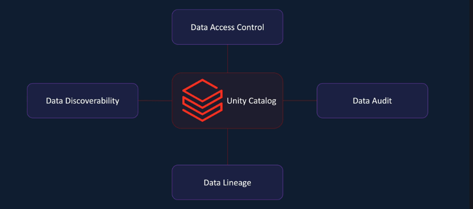
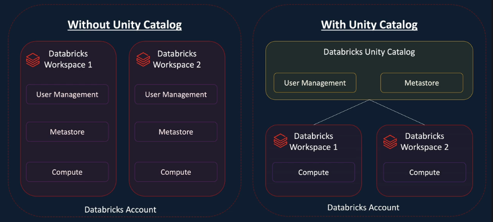
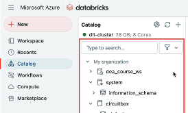
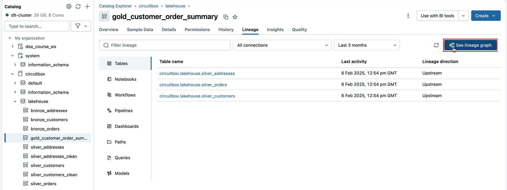
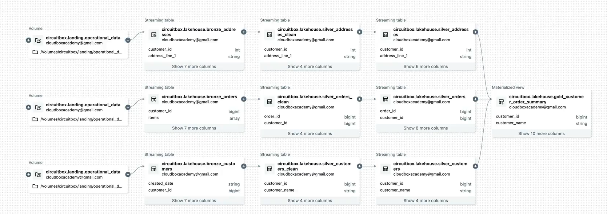
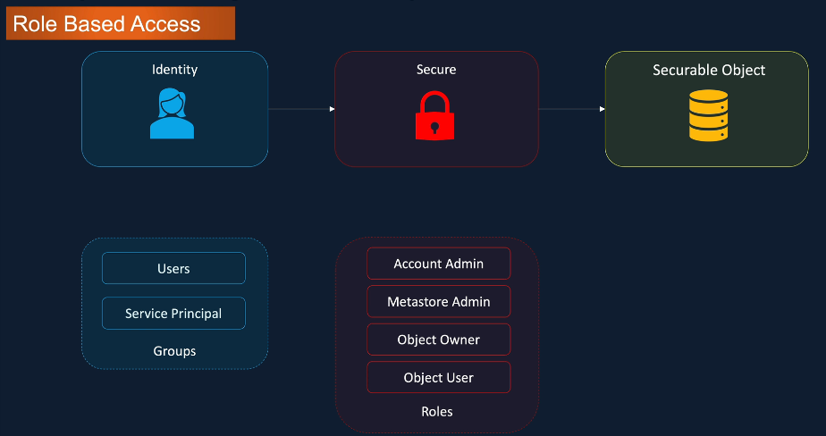
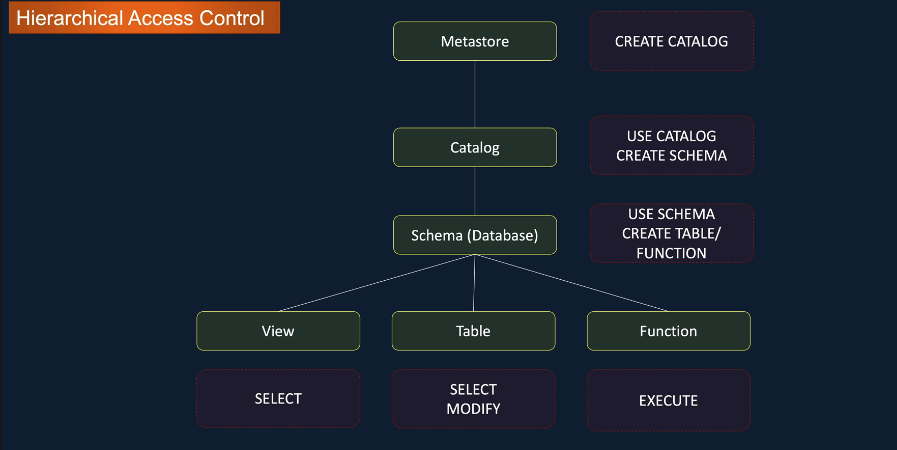
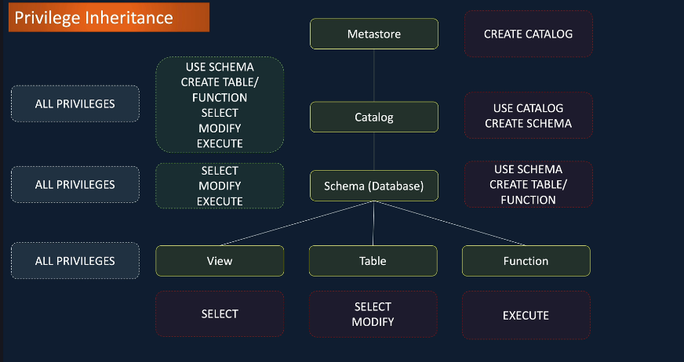

# 5. Data Governance
## Databricks SQL 
When you enable the **Serverless** option in `SQL Warehouse`, you’re telling Databricks:

> I don’t want to manage clusters — just give me a fast, elastic compute environment and only charge me for what I use.
<br> -> instant startup | ad hoc sql queries | auto scaling | dashboard queries

### SQL Editor 
In `SQL Editor`, you can write a query and save that query. Additionally, you can create dashboards based on that query. 

### Alerts
In `Alerts`, to create an alert, you MUST have a query. <br>
The way `Alerts` work is that, they take the output from a query, and based on the output, you can **define a condition** and **trigger an alert** if the condition evaluates to true. 

E.g., there is an alert if the **total_amount** exceeds 50k. <br>
We first `Create alert` -> name the alert and choose the corresponding query -> adjust the `Trigger condition`


## Intro to Data Governance
Databricks delivers **data governance** using a set of integrated tools that ensure security, access control, compliance, **data quality and auditability**. 
> Unity Catalog is the core governance product in Databricks. It is a Databricks offered **unified solution** for implementing data governance in the Data Lakehouse.

## Data Governance with Unity Catalog

- `Data Access Control`: restrict access to only required users and groups.
- `Data Audit`: how the user is using the data and how often and when it's being accessed -> available audit logs 
- `Data Lineage`: trace back the data to its source to ensure authenticity; provides lineage both downstream and upstream in a pipeline
- `Data Discoverability`: Databricks makes a **searchable data catalog** with the help of Unity Catalog

An account **level Unity Catalog** that contains user management and the metadata management, where `User Management` and `(Unity Catalog) Metastore` are centralized. 


### Demo 
Access `Catalog` on the left tab to modify -> use the searching bar in the UI to look for the desired tables/schemas.



To see `Data lineage`, click `See lineage graph` and you will see the complete DAG to the table. 





## Security model


- `Account admin` is the highest level user in Unity Catalog as they have full access to **EVERY metastore** associated to the Databricks account.
- `Metastore admin` will have similar capabilities to Account Admin, but they can only access the metastore that they're administrator for.
- Each `object` within metastore has an `owner` (by default, the user/service principal that creates the object)
- `Object user`: users in the Enterprise

### Access Control List 
_To grant a privilege:
```sql
GRANT <privilege> 
ON <securable_object>
TO <identity>

GRANT SELECT 
ON TABLE customers
TO sales
```

_To remove a privilege:
```sql
REVOKE <privilege>
ON <securable_object>
FROM <identity>

REVOKE SELECT 
ON TABLE customers 
FROM sales
```
In case we want to use the `UI`, click on the `Metastore object` (e.g., table) that we want to modify the privilege -> choose `permission` tab -> type in the **principals** (i.e., the users) and tick on the desired privileges.


### Hierarchical Access Control
_We need to first provide `USE CATALOG` and `USE SCHEMA` for the users in order to `SELECT table`.



---

**Privilege inheritance**: it makes the privileges for the *child objects* available at the *parent level* in the hierarchy.

So you can grant SELECT privilege on all the tables **in a schema** with one statement. <br>
-> this will also be applicable for the current and future tables created in that **schema**.



For more info about different privilege types, refer to [Privilege types by securable object in Unity Catalog](https://docs.databricks.com/aws/en/data-governance/unity-catalog/manage-privileges/privileges#privilege-types-by-securable-object-in-unity-catalog).
