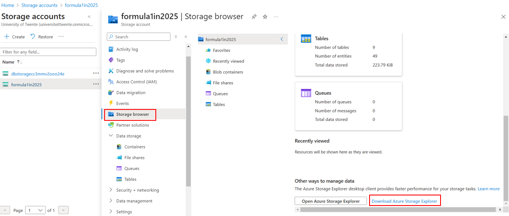

# Introduction

## What is Databricks?

- Is an **open analytic platform** for building, deploying, sharing and maintaining enterprise-grade data, analytics and AI solution at scale | built on Apache Spark
- Can: build an enterprise data lakehouse | ETL and data engineering | ML, AI … | data warehousing, analytics and BI | DevOps

# Create Azure Databricks Service

- Step 1: Acces [portal.azure.com](portal.azure.com) and choose _Create a resource_. Search for `Azure Databricks`.
- Step 2: Fill in the form.

  - Basics
    - Subscription: either Pay-As-You-Go or Student Account.
    - Resource group: where we keep all resources needed. Suggested name: `databrickscourse-rg`
    - Workspace name: suggested `databrickscourse-ws`
    - Region: choose the one that is (near) you for low latency. Regarding optimization for Student Account -> choose `UK South`
    - Pricing Tier: choose `Premium`
  - Networking: set all by default (unless you want your own configuration)

- Step 3: hit `Create` button. It will take quite a while (~5mins) to complete validation and creation.

- Step 4: Launch the workspace to actually use Databricks

# Overview of Databricks UI


- `New`: let you create some of Databricks objects, such as Notebooks, clusters, ... etc
- `Workspace`: a container for holding a set of folders, libraries and files. By default, each user has their **own workspace** and also **the shared one**. There is also Git in this section that allows you to migrate your work in GitHub.
- `Catalog`: let us interact with any tables that you created
- `Workflow`: contain jobs, job runs, and Delta Live Tables
- `Compute`: let us create clusters, cluster pools and SQL data warehouses.

## Architecture Overview


- Is split into 2 parts:
  - `Control Plane`: located in Databricks own subscription, containing:
    - Databricks UX
    - Cluster Manager: when a cluster is requested by the user, the Cluster Manager will create the required VM in our subscription via Azure Resource Manager
    - Databricks File System (DBFS)
    - Metadata about Clusters, Files Mounted, etc ...
  - `Data Plane`: located in the customer subscription. When creating Databricks services in Azure, there are 4 resources created in your own subscription:
    - A virtual Network and Network Security Group for the VNet
    - Azure Blob Storage for the default storage (_not recommend for the permanent data storage_)
    - A Databricks Workspace

# Databricks Cluster

## Cluster types

- A cluster is basically a collection of VMs, where each consists of a **Driver node** and (one or more) **Worker nodes**. <br>
  Clusters allow us to treat this group of computers as a **single compute engine** via the Driver node.
  

- There are 2 types of clusters:

|     |            All purpose             |             Job cluster             |
| :-- | :--------------------------------: | :---------------------------------: |
|     |          Created manually          |           Created by jobs           |
|     |             Persistent             |  Terminated at the end of the job   |
|     | Suitable for interactive workloads |  Suitable for automated workloads   |
|     |      Shared among many users       | Isolated just for the job workloads |
|     |          Expensive to run          |           Cheaper to run            |
|     |    -> Interactive analysis work    |     -> Repeated production work     |

<br>

- `Cluster Policy`: help us with pre-configuration, so that creating a Cluster will become easier. Also, it helps restrict the maximum size of the Clusters being created to keep the cost under control.

## Cluster Configuration


- `Single node` or `multi node`: Multi node will have one Driver node and (one or more) Workers node. Single node does not have Worker nodes, so only light-weight workload.
- `Access mode`: there are 4 types

  - **Single user**: only allows **a single user** to access the cluster. Supports Python, SQL, Scala, R.
  - **Shared**: multiple user access; provides process isolation -> each process gets its environment, so one cannot see the data nor credentials from the other.
  - **No isolation shared**: also allows the Cluster to be shared amongst more than one user. Different from the `shared` mode is that this does not provide any process isolation, thus failure in one user's process may affect the others. <br>
    Also, it does not offer any task preemption -> one running process may use up all the resources and the other may fail.

- Runtime: the set of core libraries that run on Databricks Clusters. There are 4 types:
  - Databricks runtime: includes an optimized version of Apache Spark library | Scala, Java, Python, R | Ubuntu libraries | GPU libraries | Delta Lake | other Databricks services
  - Databricks runtime ML: Databricks runtime + ML libraries (PyTorch, Keras, TensorFlow, XGBoost, ...)
  - Photon runtime: Databricks runtime + Photon Engine (i.e., Databricks native vectorized query engine that runs SQL workloads faster and reduces your cost per workload).
  - Databricks runtime light: for jobs that are not requiring advanced features such as auto scaling, reliability, and improved performance. <br>
    It is only suitable for Automated Workloads, cannot use it for Interactive Workloads nor Notebook jobs.
- Auto termination: avoid unnecessary costs on ilde clusters (terminate cluster after _n minutes_ of inactivity)
- Auto scaling: automatically add/remove nodes from the Cluster depending on your workload.
- Cluster VM Type/Size:

  - Memory Optimized: recommend for memory intensive applications. E.g., a ML workload that caches a lot of data in memory.
  - Compute Optimized: useful for structured streaming applications, where you need to make sure that the processing rate is above the input rate at peak times of the day.
  - Storage Optimized: recommended for use cases requiring high disk throughput and I/O.
  - General Purpose: recommended for Enterprise applications and analytics with in-memory caching.
  - GPU Accelerated: recommended for Deep Learning models which are data and compute intensive.

- Cluster Policy (_only available in Premium Tier_): Administrators can create policies with restrictions, and assign them to users/groups -> achieve cost control by limiting the maximum size of clusters.

## Azure Databricks Pricing


- Depends on a number of factors:

  - Type of workload (All purpose, Jobs compute, Databricks SQL, Photon Engine...)
  - Tier of Databricks workspace (Standard/Premium)
  - VM type (General Purpose/GPU/Optimized)
  - Purchase plan (Pay-as-you-go/Pre-purchases)
  - We also have to pay for the VM themselves too.

  ### Databricks Unit

  - Is a normalized unit of processing power on the Databricks Lakehouse Platform used for measurement and pricing purposes.

## Azure Databricks Cluster Pool

- Clusters usually take time to start up an Auto Scale. In order to minimize that time, we can use **Pools**. <br>
  -> Cluster Pool is basically a set of idle, ready to use VMs that allow us to reduce the Cluster start and Auto Scaling time. E.g.,

## Cluster Policy

- Is basically a set of rules which allows us to hide or take out the configuration options. They allow us to fix the values of some of the configuration params and restrict access for the users -> easier UI.
- An admin can create a policy and assign that to a set of users.
- Cluster policies take away **the need for an administrator** to be involved in every cluster creation decision.

  ### Define the policy

  - JSON format

  ```
    {
      "spark_conf.spark.databricks.cluster.profile": {
        "type": "fixed",
        "value": "singleNode",
        "hidden": true
      },
      "node_type_id": {
        "type": "allowlist",
        "values": [
          "Standard_DS3_v2",
          "Standard_D3_v2",
          "Standard_DS12_v2",
          "Standard_D12_v2"
        ],
        "defaultValue": "Standard_DS3_v2"
      },
      "autotermination_minutes": {
        "type": "fixed",
        "value": 20
      },
      "spark_version": {
        "type": "fixed",
        "value": "auto:latest-lts",
        "hidden": true
      },
      "cluster_type": {
        "type": "fixed",
        "value": "all-purpose"
      }
    }
  ```

  

  - You can also override (inherit) the policy.

# Databricks Notebooks

## Magic command

- In case you want to write SQL commands in a Python environment -> follow this command:

  ```
  %sql
  SELECT ...
  ```

- To list all the files in system -> use this command:
  ```
  %fs
  ls
  ```

# Databricks Utilities

## File system utilities

- To see what contents we have in a Folder, use the command:

  ```
  dbutils.fs.ls('<folder_path>')
  ```

  This will output as a **Python list**.

- To get help with any method in this package:
  ```
  dbutils.fs.help('<name_of_method>')
  ```

# Azure Data Lake

## Accessing Azure Data Lake from Databricks

- In Databricks, we generally use Azure Data Lake Storage Gen 2 as the Data Lake Storage solution.

  ### Create Storage Account

  - Step 1: go to Azure Portal -> Create new resource -> Search for _Storage Account_ -> Create
  - Step 2: fill in the form for creation. The setting should be similar to the below images. Everything else can be set _by default_.
    
    
  - Step 3: Deploy the resource
  - Step 4: after deployment, click `Go to resource` to go to the `Storage Account`. Then, on the left menu, cick on tab `Data Storage` -> `Containers`. In this project, we are having 3 containers called: **raw, processed and presentation** (~ equivalent to bronze, silver and gold).
  - Step 5: create the 3 containers.
    

## Azure Storage Explorer

- By using ONLY the web browser, you dont have many choices in performing operations.
  Therefore, a desktop tool has come to help with interacting with DataLake, called `Azure Storage Explorer`.

  ### How to download?

  - Step 1: Navigate to `Storage Accounts` tab in Portal Home.
  - Step 2: choose the newly created storage account, then choose `Storage browser` -> `Download Azure Storage Explorer`

  

  - Step 3: it will now redirect to an Azure page. Click on tab **Download** and choose the corresponding OS. After that, run the `.exe` file to finish with the setup
  - Step 4: Open the application and sign in with your Azure account. You will be able to see the folder contents after having successfully signed in.

## Access Azure Data Lake Gen2 using Access Keys

- In Auzre notebooks, if you want to get data from your storage -> use `access key` to access your storage

  ### What is Access Key?

  - Each storage comes with 2 keys (512 bit)
  - Give full access to the storage account

  ### Access Key - Spark configuration

  - To access the data from Databricks, we need to **provide one of the access keys to Azure Databricks**, so that it can authenticate to the ADLs Gen2 service.
  - By assigning the access key, to a Spark configuration called `fs.azure.account.key`.
    ```
    spark.conf.set(
      "fs.azure.account.key.formula1in2025.dfs.core.windows.net",
      "<key>"
    )
    ```
    

  ### Access Key - abfs driver

  - A new driver, which is part of the Apache Hadoop suite of products
  - Starts with `abfs[s]://`; the optional `s` ensures TLS (Transport Level Security). The data will be encrypted while at transit.
  - The syntax: `abfs[s]://<container>@<storage_account_name>.dfs.core.windows.net/<folder_path/file_name>`
    <br> E.g., `abfss://demo@formula1dl.dfs.core.windows.net/test` URI points to a folder **test** within the **demo** container.

  ### Practical

  - Step 1: open Databricks workspace.
  - Step 2: create a new folder (straight under `Workspace`), not under any specific user.
  - Step 3: get the access key: go to Portal -> navigate to the storage account -> get Keys.
    
  - Step 4: use Spark config to set the access key.
    

    (_Optional_) You can wrap the command in `display()` for better formatted output.

## Access Azure Data Lake using SAS token

- Can be used to control access at a more granular level
- Can restrict access to specific resource types or services. For example, we can allow access to only Blob containers
- Allow specific permissions. For example, allow Read-only access to a container
- Restrict access to a specific time period
- Limit access to specific IP addresses

  ### Shared Access Signature using Spark config

  For instance:

  ```
  spark.conf.set("fs.azure.account.auth.type.formula1in2025.dfs.core.windows.net", "SAS")
  spark.conf.set("fs.azure.sas.token.provider.type.formula1in2025.dfs.core.windows.net", "org.apache.hadoop.fs.azurebfs.sas.FixedSASTokenProvider")
  spark.conf.set("fs.azure.sas.fixed.token.formula1in2025.dfs.core.windows.net", "<token>")

  ```

  

  ### Practical

  
  When generating the SAS token, it will ask to choose which `access key` will be used to sign the SAS token. IF THE ACCESS KEY IS RE-GENERATED, YOU WILL NOT BE ABLE TO USE SAS TOKEN EITHER.

  After having generated the token, just simply copy paste into the missing place. The remaining procedure should be the same as working with `Access Key`.

## Access Azure Data Lake using Service Principal

### What is Service Principal?

- Similar to user account
- Can be registered in Azure Active Directory and assigned permissions required to access resources
- Is recommended method to use in automated tools like **Databricks jobs**, **CI/CD pipeline**
  

### Practical


After this, you need to assign the role to the Data Lake:

- Go to the dedicated storage account
- Choose `Access Control (IAM)` on the tab menu -> `Add` -> `Add role assignment`
- Search for `Storage Blob Data Contributor` -> Next
- Assign access to `User, group or service principal` -> Select member (i.e., the storage account you created)
- Finally, `review and assign`.

## Cluster Scoped Authentication

### About

- What we have been doing so far is validating the authentication within the session established by the execution of the Notebook (**Session Scoped Authentication**). The authentication is only valid **WITHIN THE SESSION**. <br>
  -> Once the Notebook is detached -> re-authenticate again. <br>

- Therefore, instead of authenticating from notebook, do it **WITHIN** the cluster at the startup <br>
  -> Every notebook connecting to the cluster has acccess to the storage (C**luster Scoped Authentication**).
- We can achieve that by: specifying **Spark config params** and corresponding **secret values** within the Cluster config <br>
  -> As the Cluster is created, it already had the Spark config set with the right Secret value.
- **Advantages**: effectively making the cluster **specific** for one permission group, in which all users require the same level of access.
- **Drawbacks**: **EVERY** notebook runs _on this cluster_ will have the access to the Data Lake.

<br> THIS APPROACH IS NOT WIDELY USED IN THE INDUSTRY DUE TO **MANY DIFFERENT** CLUSTERS BEING CREATED FOR DIFFERENT ROLES -> waste of resources

### Practical

- Step 1: Go to `Compute` tab -> `Edit` button on the right corner
- Step 2: expand the `Advanced options` -> scroll down to the bottom
- Step 3: as the Spark config is in the format `key value` separated by blank space, edit it as follow:
  ```
  fs.azure.account.key.formula1in2025.dfs.core.windows.net <your key>
  ```
- Step 4: confirm and restart the cluster

  **Note:** You can also do that with SAS token and Principal Services.

## Securing access to Azure Data Lake

### Overview

- `Secret Scope` (in Databricks): a collection of secrets identified by a name. There are 2 types:
  - **Databricks backed Secret scope**: a secret scope is backed by an encrypted databricks database owned and managed by Databricks. <br>
    We can create and alter the encrypted database using the _Databricks CLI_ or the _API_; cannot use Graphical UI.
  - **Azure Key Vault backed Secrete scope**: the secrets are created and managed in Azure Key Vault. By keeping the secrets in Azure, they can be shared among other Azure services such as Azure Data Factory, Azure Synapse Analytics, ...


### Creating Azure Key Vault

- Step 1: click `Create a resource` -> Search for _Key Vault_
- Step 2: in **Access Configuration** tab, in **Permission model**, choose `Vault access policy`.
- Step 3: Create the resource
- Step 4: After having created -> go to the `Key Vault` -> `Objects` -> `Secrets` -> `Generate/Import`

  

- Step 5: Create a secret. In this example, I'm gonna set my `Access Key` as the secret.

  

### Creating Secret Scope

- Step 1: Navigate to the homepage of Databricks (by clicking the icon). Then add **#secrets/createScope** at the end of the URL. This URL is case sensitive. For example, scope in createScope must use an uppercase S).
  

- Step 2: fill in the form

  - Manage Principal: choose `All workspace user`
  - DNS name: go to the created `Key Vault` -> `Settings` tab -> `Properties` -> `Vault URI`.
  - Resource ID: also the `Resource ID` in the same session as above.

- Step 3: click `Create`

### Databricks Secrets Utility

- Purpose: to get secret values from Databricks Secret Scope and Azure Key Vault.

- Different methods in dbutils.secrets:

  - To view all the created Scopes, use `dbutils.secrets.listScopes()`
  - `dbutils.secrets.list(scope="<scope_name>")`
  - To achieve the secret value: `dbutils.secrets.get(scope="<scope_name>", key="<key_value>")` -> however, it will only be showed as **REDACTED**

  

  #### Using Secrets utility in Cluster

  - Go to `Edit` in a Cluster in Databricks.
  - Edit several things in Spark config: `fs.azure.account.key.<storage_account>.dfs.core.windows.net {{secrets/<secret_scope_name>/<secret_name>}}`

## Mounting Data Lake Containers to Databricks

### Databricks File System

- Azure Blob Storage is created and mounted to DBFS -> we are able to run DBFS to interact with Blob Storage.
- Can be accessed from any of the Databricks Clusters created in this workspace.
- Is NOT a storage solution itself.
  

  ### FileShare folder

  - Place we can upload files to using the Databricks UI
  - Is available for everyone who has access to the workspace.
  - This folder and the storage will be dropped when you delete the workspace.
  - Used in these scenarios:

    - Do quick analysis on a set of data which is very small volume and not worrying about authentication
    - To store files being used in the current notebook, such as image, charts, etc ...

    #### How to enable?

    - Step 1: DBFS by default is off, so we have to turn it on.

      

    - Step 2: maybe refresh the page so that the DBFS can take effect. From the menu bar of Databricks, choose `Catalog` tab. On the right hand side, click on `Brows DBFS` button. The `DBFS` should appear.

      

    - Step 3: upload the data into the folder. After having uploaded, go back into the `Notebook` to interact with the data in the folder.

      

  ### Mounting Azure Data Lake Storage Gen 2

  It is recommended to use `Service principal` for mounting. However, I am using Student subscription, thus cannot operate in that method due to some limited restrictions. <br>
  -> Im gonna use `Access Key` for mounting.

  - Step 1: define the required params to access the Data Lake. PAY ATTENTION that the URL is `wasbs`, NOT `abfs` like usual.
  - Step 2: define the _mounting point_ (where it will be stored after having mounted) as well as the configuration
  - Step 3: use `dbutils.fs.mount()` to mount with provided params.

    ```
    container_name = "demo"
    storage_account = "formula1in2025"
    key = dbutils.secrets.get(scope="formula1-scope", key="formula1-access-key")

    source = f"wasbs://{container_name}@{storage_account}.blob.core.windows.net/"
    mount_folder = "/mnt/formula1in2025/demo"
    config = {"fs.azure.account.key." + storage_account + ".blob.core.windows.net" : key}


    mounted_list = dbutils.fs.mounts()
    mounted_exist = False

    for item in mounted_list:
        if mount_folder in item[0]:
            mounted_exist = True
            break

    if not mounted_exist:
        dbutils.fs.mount(source = source, mount_point = mount_folder, extra_configs = config)
    ```

    

  After mounting, you can use the **file system semantics** (_instead of the long URL_) to access storage.

  

  **Note:** In order to `unmount`, use `dbutils.fs.unmount("/mnt/formula1in2025/demo")`

# Solution Architecture

- `Azure Architecture Center`: provides guidance for designing and building solutions on Azure using established patterns and practices
- You can refer to [Azure Architecture Center](https://learn.microsoft.com/en-us/azure/architecture/) for different architectures depending on your needs. <br> Also, specifically Databricks, you can go to their [blogs](https://www.databricks.com/blog) to update the latest solution.
- **For example**: the [solution](https://learn.microsoft.com/en-us/azure/architecture/solution-ideas/articles/azure-databricks-modern-analytics-architecture) below describes a solution idea where your cloud architect can use this guidance to help visualize the major components. <br>
  This solution gets real time events via Event Hub and regular batch data from Azure Data Factory -> processed by Spark on Databricks -> go through the layers bronze, silver, gold -> made available for all workloads (ML, BI) via PowerBI | export to Microsoft Fabric
  

In the project, we mainly focus on the Databricks part, which can be partially seen as this [solution](https://learn.microsoft.com/en-us/azure/architecture/solution-ideas/articles/ingest-etl-stream-with-adb). Bronze stores the raw data (_namely raw layer_) | Silver stores the filtered, cleansed and augmented data (_namely processed/ingested data_) | Gold stores highly aggregated data with key business level information (_namely presentation layer_). <br>
From left to right, the **quality of data** improves and the **business value** of the data also increases.  


# Spark SQL

## Hive Meta Store

- Data is stored in Data Lake in various types, such as csv, parquet, json ... In order for Spark to treat the data as tables and columns <br>
  -> Need to register this data in a meta store.
- Meta store is a storage for storing the metadata about the data files. For example, location of the file, the format of the data, column names, ...
- Spark uses `Hive Meta Store` (which is provided by the Apache Hive project). When choosing the storage for `Hive Meta Store`, there are 2 choices:
  - `Default managed Meta Store`
  - `External Meta Store (Azure SQL, MySQL, ...)`
- In Spark, there are 2 types of `Table`:
  - `Managed`: Spark maintains both `the metadata` in Hive Meta Store and also `the data files` associated with the table (which are stored in ADLs). When you drop the managed table, you also drop the data as well.
    <br> The data is created in Databricks default location (_dbfs:/user/hive/warehouse/_)
  - `External`: Spark only manages `the metadata` and **we** manage `the data files`. When you want to remove the data (e.g., delete the table), you will have to run commands to remove the data from the file systems separately. Dropping the table itself WON'T have effect.
    <br> We must specify an **external location** (_LOCATION 's3://...' or abfss://...'_).

# Data Loading

- Full Load: not suitable for large amount of data.
- Incremental Load: suitable in scenario that we only receive the CHANGED data since the last load. E.g., regarding the project, day 1, you get the data of day 1; when it comes to day 2, you only load the data of day 2. Applies on day 3, day 4, ... day n.

<br>

# Delta Lake (Lakehouse)

## About

- Open source storage layer that brings reliability to Data Lakes
- Provides ACID transactions

## History

### Data Warehouses

- Data Warehouse came into existence in 1980s when business wants to gather all in one place rather than looking in each individual department. Some large data warehouses also gather **external** data to make intelligent decisions.
  - Data received mainly in SQL tables, CSV files or semi-structured (JSON, XML).
  - Then, go through the ETL process to go into Data Warehouses/Marts. Then, consumed for analytics.
- However, in early 2000s, due to the popularity of the Internet, a significant increase in volumes of data + a change in variety of data (unstructed data such as vids, imgs, ...), but data warehouses are not able to handle these data. <br>
  Moreover, the data was only loaded after being extracted and transformed -> took longer to develop a solution to get new data into data warehouse. And it's expensive to store data and yet provides support for Data Science or ML/AI workloads.

### Data Lake

- Data Lake came into existence around 2011.
- Not only handle structured and semi-structured data, but can also handle unstructred data
  - Data received is ingested into Data Lake without any kind of cleansing or transformation -> result in quicker timescales to develop solutions as well as fast ingestion time.
  - Cost of storage is cheap -> ingest freely without much worrying
  - Can use the raw data as well as the transformed data
- However, there is a problem: Data Lakes are too slow to service interactive BI reports, and lack of data governance. Also no support for ACID transactions and unable to handle corrections to data (i.e., rewrite the entire partition). No roll back any data being written (no history or versioning).

### Data Lakehouse

- Basically Data Lake with `ACID` transaction controls, came to existence since 2018 and rapidly evolving, introducing versioning, BUT still can't be compared to data warehouses regarding BI reporting.
- `Databricks Architecture` has 2 stages:

  - First stage transforming the raw data to provide structure, perform data cleansing and quality, etc... and return to a set of tables (which are called **silver tables**). The raw tables are called the **bronze tables**.
  - The data from the **silver tables** are aggregated to provide business meanings (i.e., **gold tables**).

- When storing the data in **parquet** file, Delta Lake also creates a transaction log alongside that file -> provides history, versioning, ACID transaction support, time travel ...


# Azure Data Factory

## About

- a fully managed, serverless data integration solution
- ingest, prepare and transform data at scale

## Problem solved

- Business wants the data to be **ingested** and **processed** quickly in a consistent manner, so that they can gain insights from the data and realize benefits.
- Traditional data integration tools struggle to handle this due to the **lack of connectors** and the ability to elastically scale
  -> Data Factory provides the ability to ingest data from all of the sources
- Say, you perform data transformation in external solution (e.g., Databricks), then you can orchestrate those transformation from Data Factory. Also applies with analytics from other sources (e.g., HDInsight, ML models...)
- Capable of publishing the dashboard (e.g., PowerBI) to the data consumers.

## NOT capable of

- Not a migration tool
- Not designed for **streaming workloads**
- Not suitable for complex data transformation (should use Databricks instead)
- Not a data storage solution

<br>

## Azure Data Factory Components

- There will be 2 main sources: **Storage** (ADLS, SQL database) and **Compute** (Databricks, Azure HDInsight).
  <br>
- When we use ADF, we need to create a component called **Linked Service** to define the connection with the sources.
- Another component is called **Activity** to define the action we take on the resources.
- The last 2 components are **Pipeline** and **Trigger**.

## Create new pipeline in ADF

- On the left menu bar, go to `Factory Resources` -> `Pipeline` -> `New Pipeline`. From there, you have numerous `Activities` to choose from.
  <br>
  Drag the tab `Notebook` to the working space (the tab Notebook in the working space is called `Activity`) and the working space itself is the whole `Pipeline`.
- Create a `Linked Service` when choosing from the `Activity` tab (you can also create it in the left menu bar, tab `Manage`).

  - In `Select Cluster` -> choose `Existing Interactive Cluster`
  - In `Authentication type` -> choose `Managed Service Identity`

    ```
    Additional steps to set up the Managed Service Identity:

    - Go to the Databricks Workspace -> on the left bar, choose tab Access control (IAM) -> Add -> Add role assignment.
    - A form appears -> Select role 'Contributor'. In `Select` space, fill in the name of Azure Data Factory -> Save
    ```

- Click into the `Notebook` instance (the activity tab) -> Modify the inner `Settings` tab -> define `Notebook path`. <br>
  Since we also have parameters for this notebook, and we also want to pass the value dynamically (not hard-coded), we can do as follow: click on the working space (for the `Pipeline`), define a `variable`. Then, click back on the `Notebook tab` -> `Settings` -> `base parameters` -> define the **name** and its corresponding **value** (click on `Add dynamic content` for the **value** part).
  <br>
  Additionally, you can also define a `parameter` (instead of a `variable`).
- After already done with the pipeline, find the button `Debug` to validate + run the pipeline.

## Improve the pipeline

### 1. Checking the constraints

There can be cases that the dataset is split into folders with their corresponding timestamps, however, we want to check if a timestamp does exist.

There is an `Activity` called **Get Metadata**. Choose it -> in the inner `Dataset tab`, configure the setting and choose the appropriate storage account name. **Note:** you also have to create `Linked Service` for this one.

With this Dataset, you need to configure the parameter, so that it can receive the params from the pipeline (the procedure is similar to the one we created for the pipeline).

To check if the folder exists or not, there is a `Field list` inside the `Dataset tab` -> choose `Exists`. Then, link this `Activity` to `If-Else Condition Activity`.

Inside the `Condition Activity`, for the `Expressions field`, add **Dynamic content** -> **@activity('Get Folder Details').output.Exists**

### 2. Trigger dependency

There is an **Activity** called `Execute Pipeline` -> configure the inner `Settings` -> `Invoke the pipeline` -> choose the pipeline that you want to execute.

With this way, you can set pipelines to run in order (in case some pipelines is the prerequisites of the others).

Now, suppose you want the pipelines to run in schedule, say, every Sunday at 6pm, you need to create a `Trigger`. From the homepage, on the left menu bar, go to `Manage` -> `Trigger` -> add a new trigger.

There are different types of trigger:

- Schedule: at a specific time
- Tumbling window: has start and end time; you can even run in the past days.
- Storage events (aka _event-based_ trigger): is triggered by the events that happened on block storage (e.g., a file arrives or a file is deleted -> the trigger is invoked)

# Unity Catalog for Data Governance

## Data Governance Overview

\_There are 4 key functional areas:

1. Data access control: control who has access to which data
2. Data access audit: capture and record (history log) all access to data | who has been accepted/rejected/revoked
3. Data lineage: capture upstream sources and downstream consumers
4. Data discovery: ability to search for and discover authorized

## Key concepts

### Metatstore
