# 1. Implement and Manage an analytic solution
## Configure Microsoft Fabric workspace settings
### Configure Spark workspace settings
What you need to know: 
- Spark nodes
- Executors 
- Tasks 

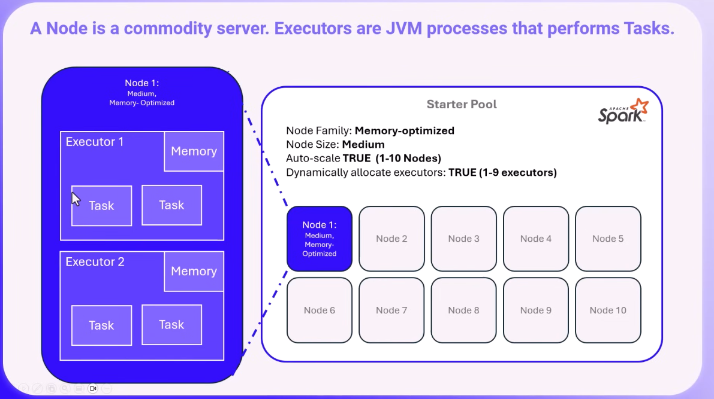
- `Starter Spark tool`: 
  - constantly run in the background -> create automatically for a workspace (using **prehydrated live pools**) 
  - fast startup time 
  - consumes Fabric capacity when used
  - **auto scale** (maximum availabe nodes in the cluster) and **dynamically allocate executors** 
  - can be customized
- `Normal Spark pool`:
  - does not support CI/CD -> use **environment** to fix this issue
  - is tied to workspace
- `environment`: creates a new item to workspace 
  - one workspace can have multiple environments 
  - default evnironment can be defined for a workspace
  - provides **runtime version**.

  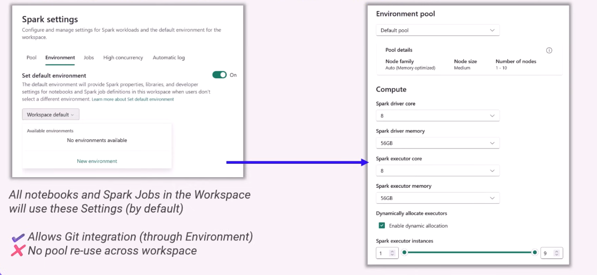

- `high concurrency`: allow notebooks share a same Spark session 
  - better resource utilization
  - faster execution
  - can be used in data pipeline with **session tag** -> e.g., notebook A starts the cluster that takes a while, and after that, notebook B (which has the same session tag as A), can run immediately without waiting the cluster to start by using the same Spark session from notebook A (normally cluster spun up in A has already terminated as soon as the notebook has done its job).
  - Session sharing conditions:
    - same user runs the notebook 
    - same default Lakehouse
    - same Spark compute configuration
    - same libraries on environment level 
    - **up to 5 notebooks** can share the same session

- `Spark job setting`: 
  - Reserve maximum **cores** for active Spark jobs: Spark estimates the min and max number of cores for that job and reserved that -> *give more reliability but less optimal*

- Click into the created environment lets you customize `Spark compute configuration`. 

> Differentiate `session` vs `environment`: You configure an ML **environment** (Python 3.10, pandas 2.2, scipy 1.12, ...). This environment is saved in Fabric.
Then you open a notebook → Spark cluster spins up → a Spark **session** starts.\
Fabric provisions compute (= session).
The **session** loads the chosen **environment** (libraries, dependencies). Your code executes inside this session.

--
### Configure domain workspace settings
First off, what is a domain? \
-> a way of logically grouping together all the data in the organization that is relevant to a particular area or field -> a grouping of **workspaces**. 

Domains help business users with **data discoverability**.

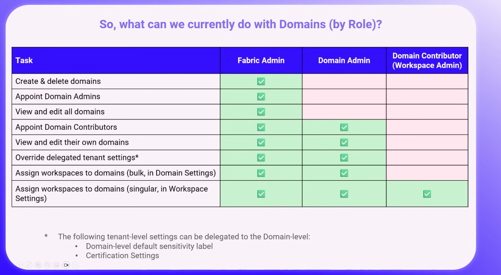

*Read more at: https://learn.microsoft.com/en-us/fabric/governance/domains*

--
### Configure OneLake workspace settings
The OneLake File Explorer (tenant-level) makes data in OneLake accessible on your local machine.

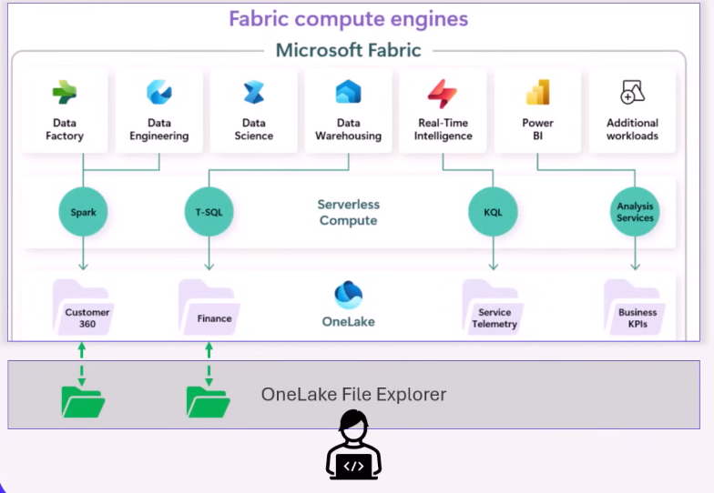

> By default, PowerBI semantic models and KQL databases do NOT get written to OneLake. If you want to enable OneLake integration for KQL database/PowerBI semantic models, turn on the `Availability` button in OneLake and turn on the `OneLake Integration` in **Tenant-level setting** respectively.

--
### Configure data workflow workspace settings
`Apache Airflow Jobs (aka Data Workflows)` is orchestration tool. But Fabric provides a mechanism to run DAG using a **Pool**. 

Tbh, idk what the exam wants to test here. Maybe ingesting data with Dataflows gen 2 in Fabric?

## Implement lifecycle management in Fabric
### Configure version control
In Microsoft Fabric, version control means **connecting your workspace to Git** *(workspace level)*.

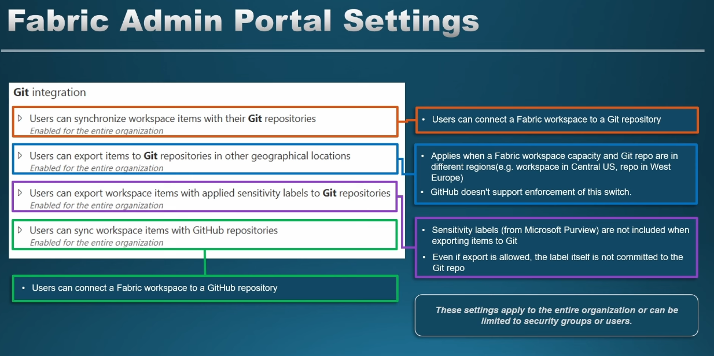

In `Workspace setting`, choose and connect to a Git provider (Github or Azure Devops).

Welp, this section is mainly about Github. Since I am familiar with Git/Github already, I'll skip this one. 

**Main things to take note:** changes, commit, push, merge, checkout branch. 

Requires Admin, Member or Contributor access to the source of workspace, and permission when branching out to a new workspace.

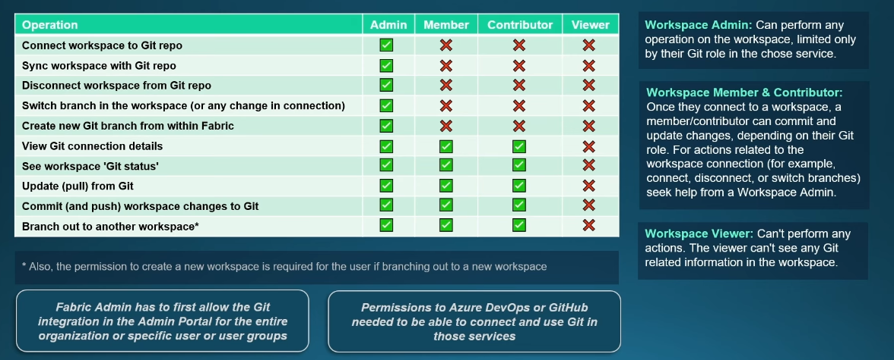

--
### Implement database projects
`SQL database project` is a local representation of SQL objects that comprise the schema for a single database, such as tables, stored procedures, or functions
-> The development cycle can be integrated into CI/CD deployment workflows.

The **development workflow** can be seen as follows: we clone the whole warehouse folder, then with help of extension "SQL Database Project" in VScode, we right click and choose `build`. The build only succeeds if there is no (syntax, logic, ...) error in the folder.  

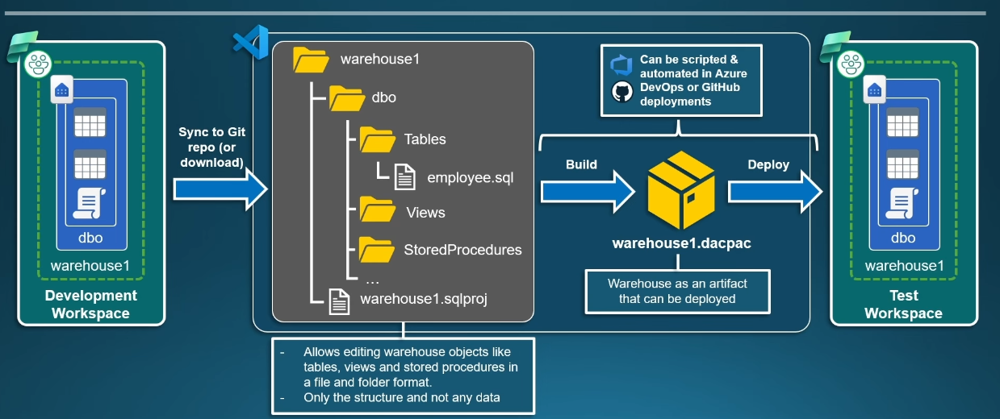

> When deploying warehouse via Fabric deployment pipeline, there is no need to use and deal with database projects (the `dacpac`) since deployment pipeline will handle that in the background.

After having built the warehouse locally, you can `publish` by adding a new profile using the **SQL connection string** from the warehouse on Fabric. 

-- 

### Create and configure deployment pipelines
`Deployment pipeline` is a built-in tool in Fabric for managing content lifecycle. It can be used to deploy changes from one workspace/environment to another. Can only grant an admin access to a deployment pipeline.

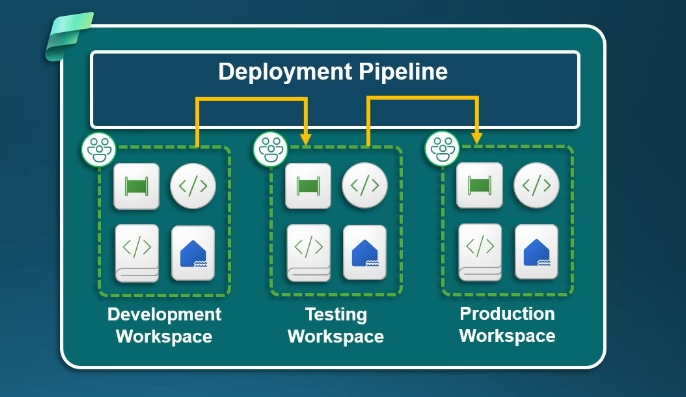

- Each block is called `stage` *(dev, test, prod)*.
  - A `stage` represents one step in the content lifecycle. 
  - Each stage is linked to different workspace. 
  - Min 2 and max 10. 
- `Item pairing`: Fabric matches items between stages (src and tgt) to know how specific item has changed. 
  - Items are paired based on their unique internal IDs -> can identify whether an item is renamed or that's a new item
  - Each item is given a status:
    - **Same as source:** No changes to the item detected  
    - **Different from source:** Item has changed in some way
    - **Only in source:** Item is new and has not been deployed
    - **Not in source:** Item doesn't exist in the source stage. Deployment will have no impact to these items.

  > With deployment pipelines, you can choose and deploy the selected items (deploy everything is not necessary).

  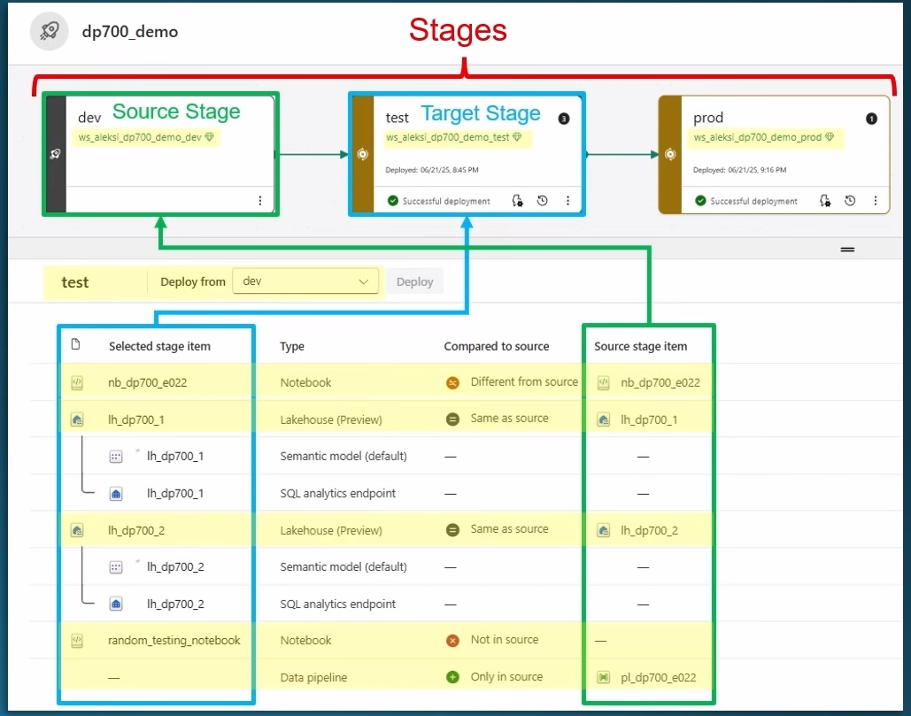

- `Deployment rules`: let you change settings like data sources or parameters when moving content between stages. This helps make sure each stage uses the right setup WITHOUT manual changes. E.g., without deployment rules, the `test workspace` might read from the lakehouse in the `dev workspace`.

  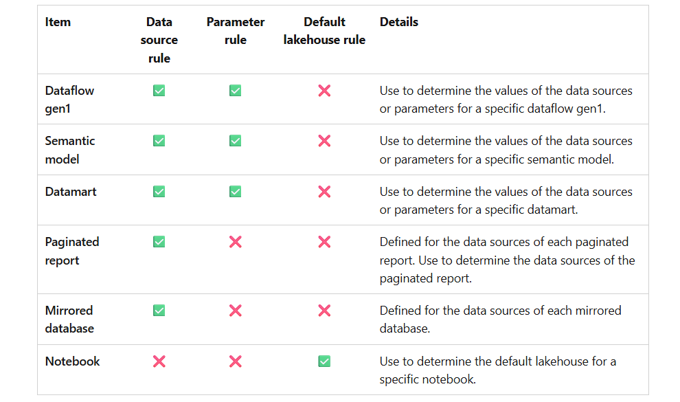
  
  > The table lists the type of items you can configure rules for, and the type of rule you can configure for each one. 

## Configure security and governance
Fabric hierarchy: 
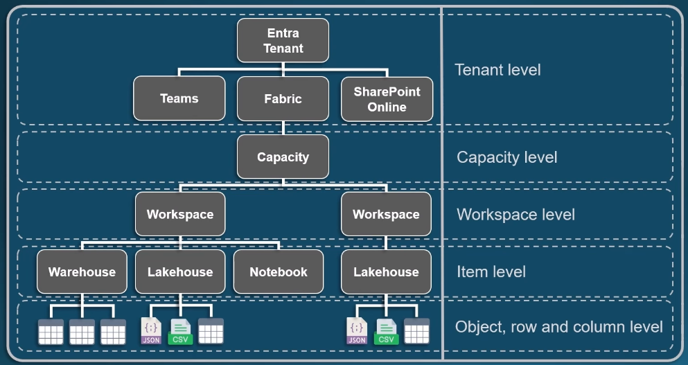

`The principle of Least Privilege`: give users the minimum level of access they need and nothing more.

Fabric has **two layers**:
  - **Control Plane** (Workspace Permissions)
    - Who can access the workspace item (lakehouse, warehouse, etc.)
    - Roles: Admin, Member, Contributor, Viewer
    - Controls access to UI and metadata

  - **Data Plane** (OneLake Security)
    - Who can access data folders, files, tables
    - Controls actual data read/write operations
    - Applies across Spark, SQL Analytics Endpoint, shortcuts, etc.

### Implement workspace-level access controls
Corresponds to the role `Admin Monitoring Workspace`.

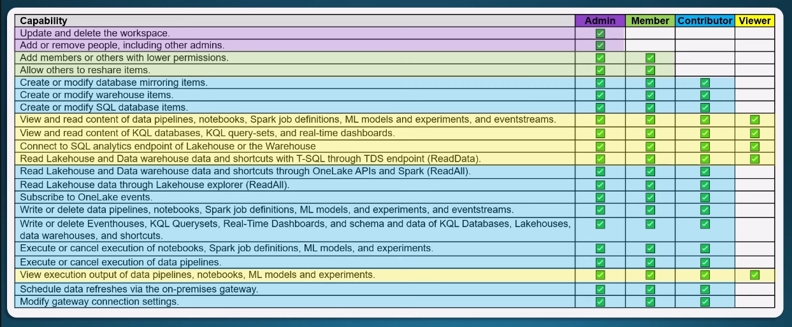

--

### Implement item-level access controls
Items by default (if not granted any other access) are `read-only` mode. 

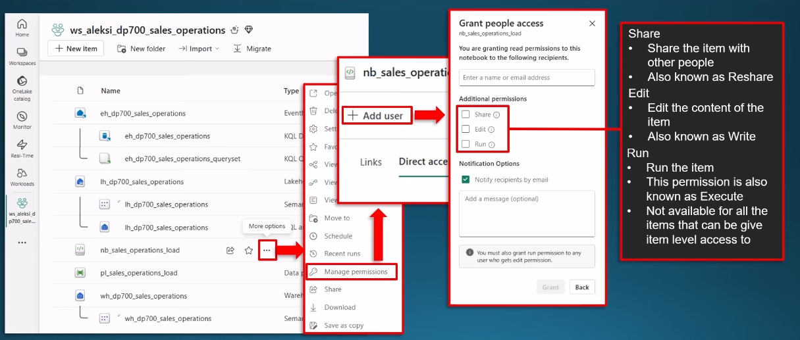 

- For shared **Lakehouse**, people can open it and its SQL endpoint and read the default dataset. To allow them read directly in the Lakehouse, grant additional permissions:
  - `Read all SQL endpoint data`: read access to all data exposed via T-SQL endpoint.
  - `Read all Apache Spark and subscribe to events`: allow users to use Spark notebooks, jobs and access row-files in Lakehouse | grant access to raw files | enable event subscription
  - `Build reports on the default semantic model`: allow use of datasets in PowerBI desktop or Fabric reports | does NOT grant direct table or file access

- For shared `Warehouse`, people can connect to it. Additional permissions:
  - `Read all data using SQL`
  - `Read all OneLake data and subscribe to events`: grant access to OneLake filesystem behind the warehouse | subscribe to OneLake events generated for the warehouse
  - `Build reports on semantic models`: similar to above
  - `Monitor queries`: access dynamic management view (DMVs) and query insight views to monitor queries.
  - `Share granted permissions`

--
### Implement row-level, column-level, object-level, and folder/file-level access controls
`Object-level security (OLS)`: control access to individual objects like schemas, tables, views and files etc ... If the user doesn't have the permission, they do not even see the objects exist. 

  - The `GRANT` statement is used to give a user or role permission to access specific objects. 

  - The `DENY` statement is used to block explicit access to a database object. `DENY` overrides `GRANT`.
  
  - The `REVOKE` statement is used to **remove** a previously granted or denied permission (it does NOT grant or block directly).
  
  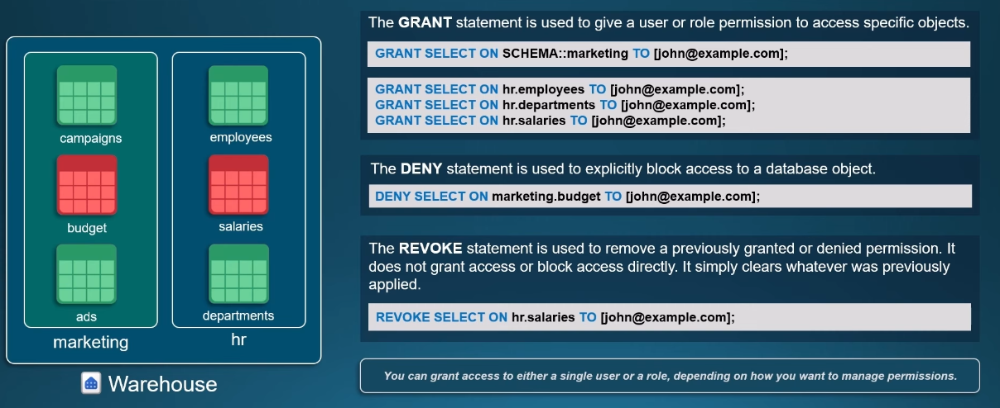

`Column-level security (CLS)`: control access to individual columns -> hide specific columns inside a table, e.g., hide salary or personal info column
  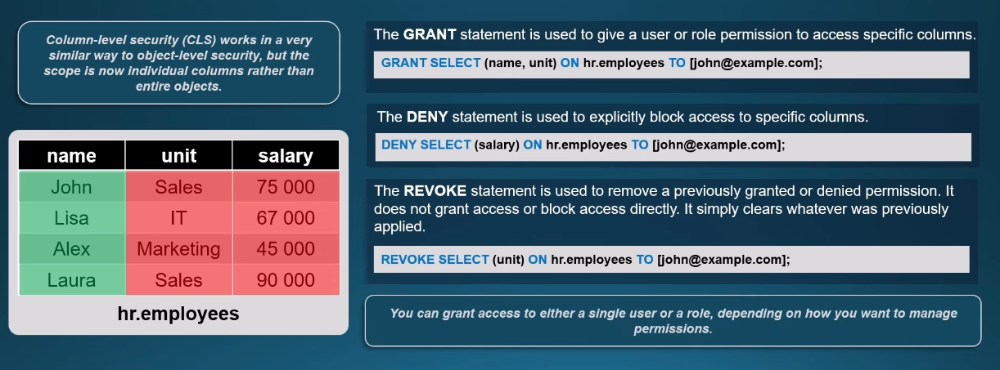

`Row-level security (RLS)`: control access to individual rows -> determine which rows user can see, e.g., salesperson is only able to see rows related to sales region.
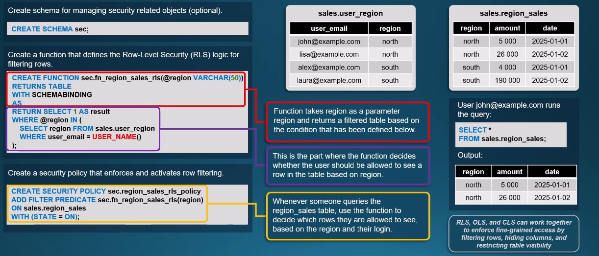

**Additional feature**: `OneLake Security` (file/folder access control)
  - is the **data-plane** security model
  - **role-based** access control 
  - controls **who can read/write which files/folders/tables** in a lakehouse, warehouse, or shortcut — independently from workspace roles.  
  - enforced consistently across engines (Spark, SQL, PowerBI)

  > For example, if you had a lakehouse with customers insights; you could use OneLake security to share the data with your analyst team to build reports while removing rows or columns containing Personally Identifiable Information (PII) like names and addresses. This security then propagates automatically, so whether users access the lakehouse from Power BI or Spark or even Copilot, they only see what you’ve authorized.

  Read more about OneLake Security: https://blog.fabric.microsoft.com/en-US/blog/onelake-security-is-now-available-in-public-preview/

--
### Implement dynamic data masking
`Dynamic Data Masking`: is a built-in security feature in Microsoft Fabric, and can be used in Warehouse and Lakehouse SQL Endpoint. 

The real data stays unchanged, and it is just masked -> **helps protect sensitive data by hiding it from non-privileged users** *(Administrative users or roles such as Admin, Member, or Contributor have CONTROL permission on the database … and can view unmasked data by default.")*.

You can define `masking rules` for specific columns.

- There are 4 types of `masking functions`:
  - `Default masking function`
    - replace entire value with a standard mask 
    - no part of the original data shown up
    - applied based on **column** type
    - syntax: `default()`
  
    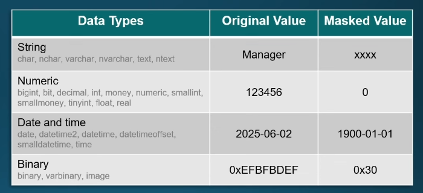

  - `Email masking function`
    - designed to mask email addresses 
    - shows the first character of the email and then masks the rest with XXX 
    - syntax: `email()`

    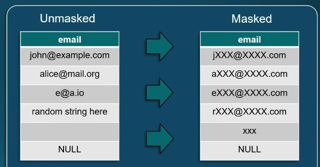

  - `Random masking function`
    - replace numeric values with a random number 
    - you define the min and max of the range 
    - the value is generated dynamically (on the fly when queried) -> each query can return a different random number 
    - syntax: `random(1, 1000)`

    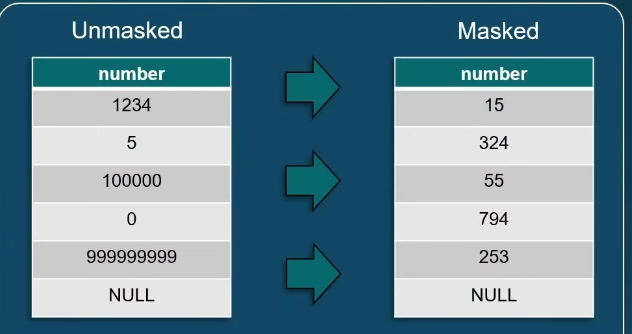

  - `Custom string masking function`
    - allows you to control which parts of the string are visible 
    - you define the starting/ending character and masking function
    - syntax: `partial(1, "*****", 2)` -> keep 1 character at the start, mask the middle with "*****" and keep 2 characters at the end

    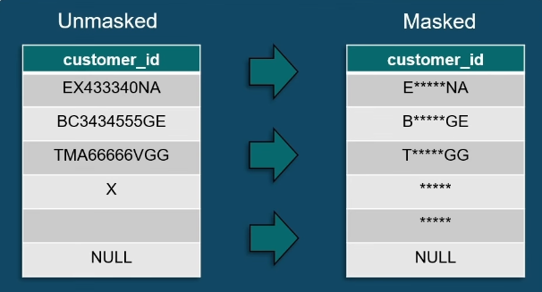 

> Some examples adding and removing masking functions:

  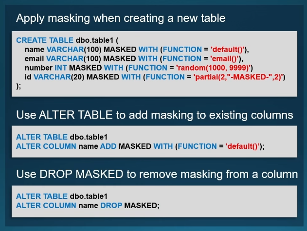

> Users with the `UNMASK` permission can view unmasked data even if they are not in a privileged role 

-- 
### Apply sensitivity labels to items

- **Configurable text labels** that you can add to Fabric items -> keep things organized and easy to find.
- Enhance data categorization and discoverability
- Only **Fabric admins** can create, rename, or delete tags
- Users with `write permission` can apply and remove tags
- Up to 10k tags can be created; each item can have up to 10 tags 

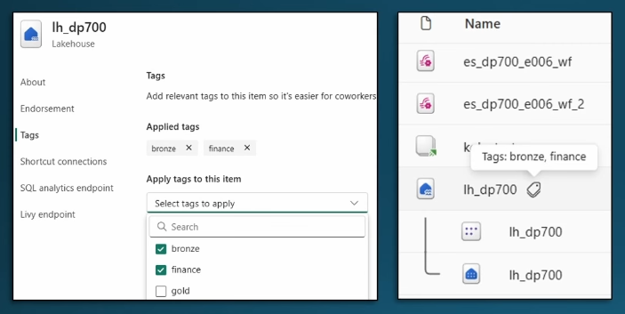

`Sentivity labels` help classify and protect Fabric items.
  - can apply encryption, watermarking or usage restriction
  - Fabric admins can enable in the admin portal
  - specific licenses are needed to use sentivity labels
  - users with write permission can apply and remove sentivity labels
  
  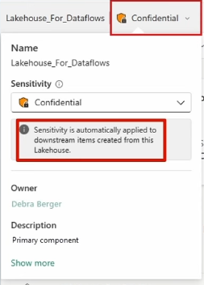

--
### Endorse items
The process of applying **an endorsement badge** to an item (like a report or semantic model) in Microsoft Fabric to **highlight its quality and trustworthiness**. We can only have 1 endorsement at a time.

`Master data` can only be applied to data stores.

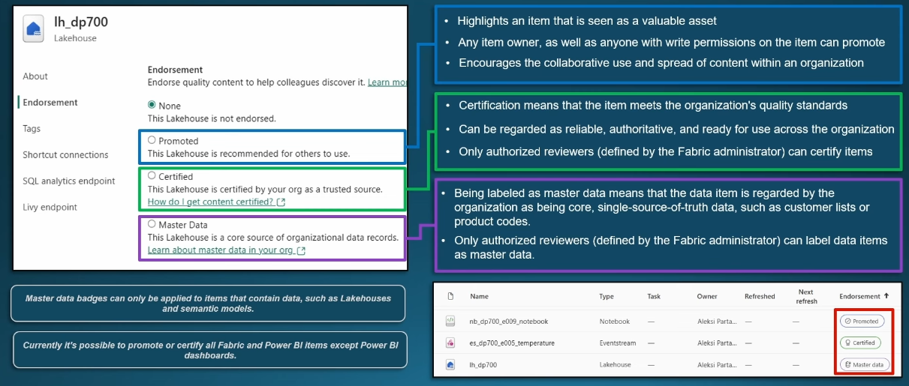

--
### Implement and use workspace logging
You can absolutely log all activities in your Fabric workspace.

You can do this by add a monitoring `Eventhouse` *(need to enable monitoring from admin portal)*.

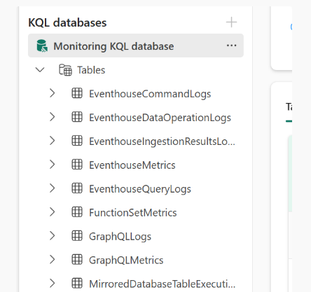

## Orchestrate processes
### Choose between a pipeline and a notebook
`Data Pipeline` is exactly similar to Azure Data Factory.

  - `Activities`: building blocks in data pipeline, divided into 3 groups
    - `Data movement`
    - `Data transformation`
    - `Control`
    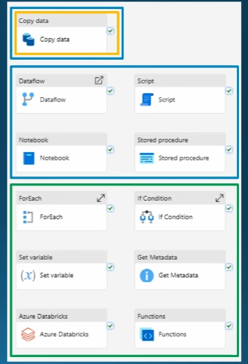
    
    - Can run and execute Fabric items (notebooks, dataflow, SQL and KQL scripts, etc ...)
    - Can run **external services**, such as Web, Webhooks, Azure Databricks, ... 
    - `COPY activity` is the primary mechanism to ingest data into Fabric 

  - `Parameters`: help in dynamic pipeline
  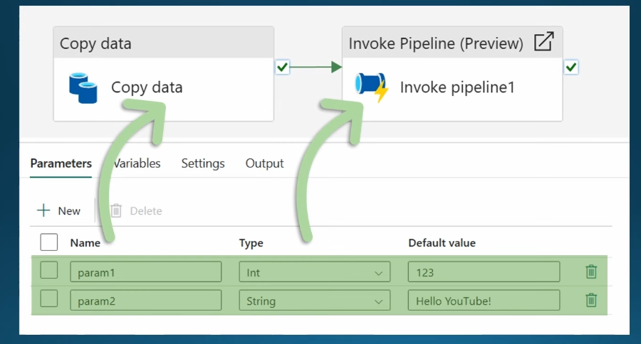

  - `Variables`: for inside the pipeline, while the parameter is for outside the pipeline

  - `Scheduling`: runs pipeline on a set time interval, stat/end date, timezone configuration ...

  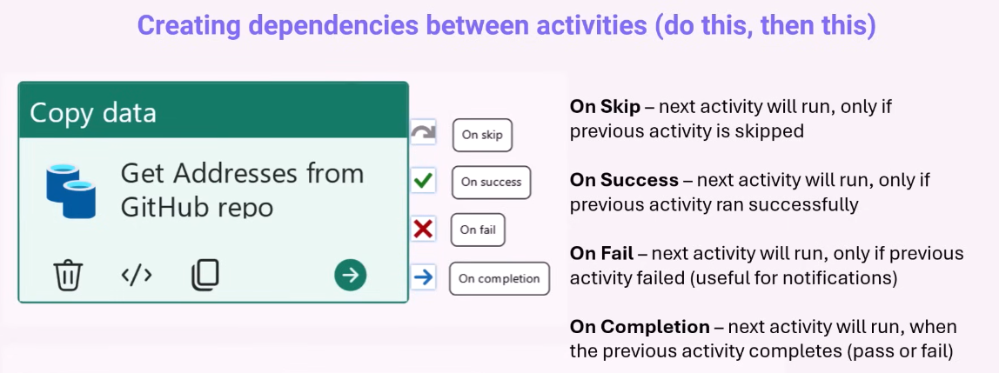

`Notebook`: where you write code and execute.
- Notebookutils: an integrated package in Fabric designed to streamline tasks (e.g., file system operations, environment variable access, ...). **Syntax:** *from notebookutils import notebook as nb*
- File system utilities (**notebookutils.fs**): interact with file systems like ADLS and OneLake 
- Notebook utilities (**notebookutils.notebook**): run notebooks, set exit values, ... 
- Magic command: %%
- Use **DAG** to run multiple notebooks

--
### Design and implement schedules and event-based triggers
- We have `Invoke Pipeline` to run another pipeline in your running pipeline. 

- `Schedule trigger` in Fabric: execution of 
  - Data pipelines
  - Notebooks
  - Dataflow Gen2

- `Event-based trigger` (for Data Pipeline): Data Pipelines can now be triggered, based on Events in an Azure Blob Storage account, by click on the button `Add trigger`.
  - In `Realtime Hub`: there are new options to trigger an Alert or Eventstream, based on some new events: job events, OneLake events, and Workspace item events.

- `Triggering a Semantic Model Refresh`: auto refresh if using DirectLake, or configure a refresh schedule on your own, or use the Semantic Model Refresh activity in a Data Pipeline.

- `Dataflow Gen2`: based on PowerQuery
  - Supported destination: Fabric Lakehouse, Warehouse, SQL database, Data Explorer
  - use **Power Query M** for transformations
  - use a compute engine in Fabric to evaluate the query
  - write results as: *Delta tables* in **Lakehouse/Warehouse**, OR *Parquet/delimited* files in **OneLake**
  - can automatically convert Power Query output into Delta tables when loading into Lakehouse or Warehouse.

-- 
### Implement orchestration patterns with notebooks and pipelines, including parameters and dynamic expressions

- `Buildi dynamic data pipelines`: for example, scan each table in a database and get its content.

- We can also `orchestrate notebook` within notebook
  - Use `dependencies` in DAG for predefined order. 
  - Pros: Run multiple notebooks in the same **Spark session**, different from the pipeline where you'll have to spin up a new Spark cluster.

