# Ingest and transform data (30–35%)

## Design and implement loading patterns

### Design and implement full and incremental data loads

For `incremental loading`, we can do it with either `watermark` column or using `CDC` _(change data capture)_. We will be using `Copy activity` to perform incremental loading.

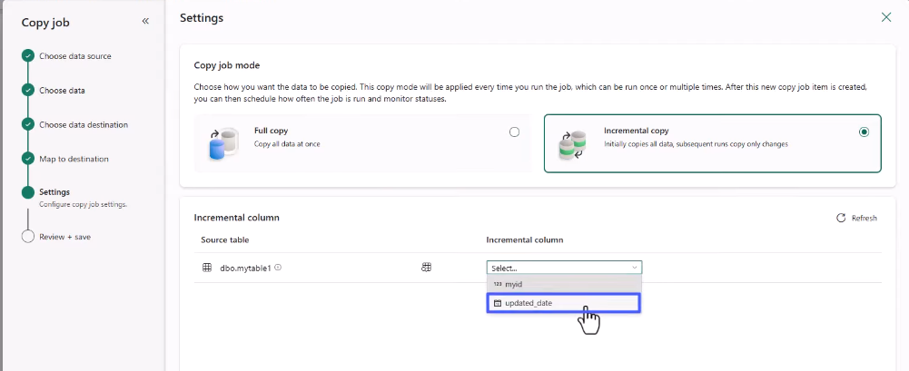

> Take into account that different storages will have different mechanisms, therefore, be careful otherwise you'll do a **write append**, rather than write merge
> 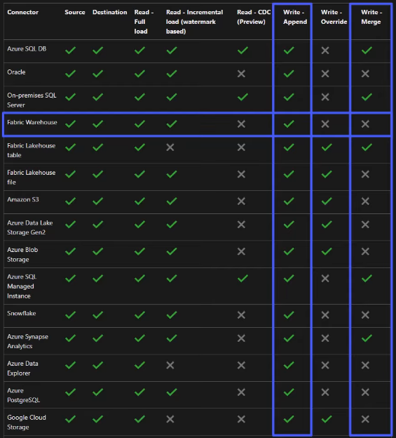

> Another way to do `incremental loading` is to use `Copy activity + watermark value`. Watermark value is a column that helps track new or changed records (using timestamp or ID). \
> For more info, refer to: https://learn.microsoft.com/en-us/fabric/data-factory/tutorial-incremental-copy-data-warehouse-lakehouse

--

### Prepare data for loading into a dimensional model

`Data model`: acts as a blueprint, guiding how data is stored, retrieved and managed

`Fact` tables store measurable data and `Dimension` tables answer "Who? What? Where?"

`Star schema` and `Snowflake schema`:

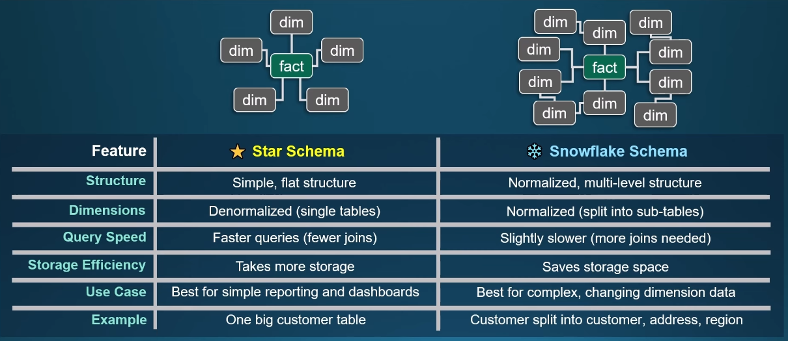

`Slowly Changing Dimension (SCD)`:

- **Type 0**: No changes
- **Type 1**: Overwrite (old data is COMPLETELY replaced by new data, no history is kept)
- **Type 2**: Add a new reord + full history is tracked (typically use start/end date).
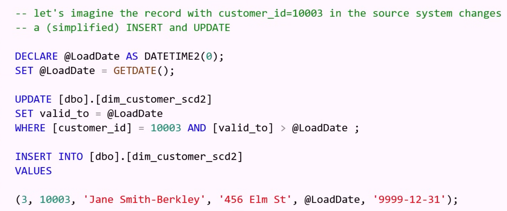
- **Type 3**: track previous value (store old value in another column) -> use when you only consider the last change (not full history)
  

--

### Design and implement a loading pattern for streaming data
An overview of streaming in Fabric: 

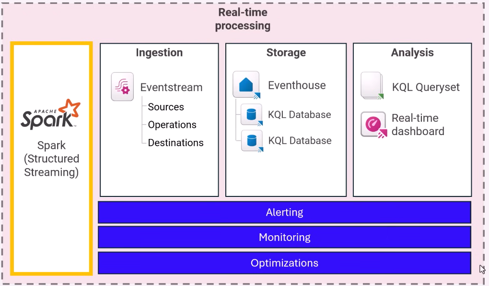


## Ingest and transform batch data

### Choose an appropriate data store

From source: https://learn.microsoft.com/en-us/fabric/fundamentals/decision-guide-data-store

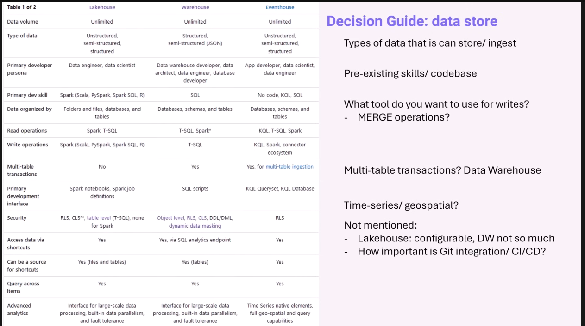

--

### Choose between dataflows, notebooks, KQL, and T-SQL for data transformation

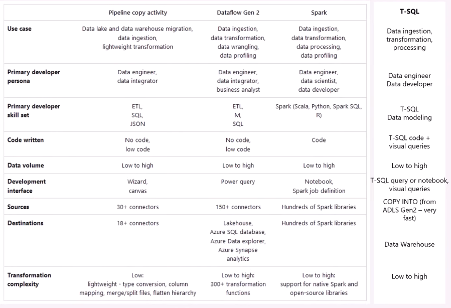

--

### Create and manage shortcuts to data

Use `shortcuts` to quickly pull data from internal and external locations into your lakehouses, warehouses or datasets. `Shortcuts` can be updated or removed from your item, but these changes will not affect the original data and its source.

To create shortcuts: `Home` -> `Get data` -> `New shortcut`

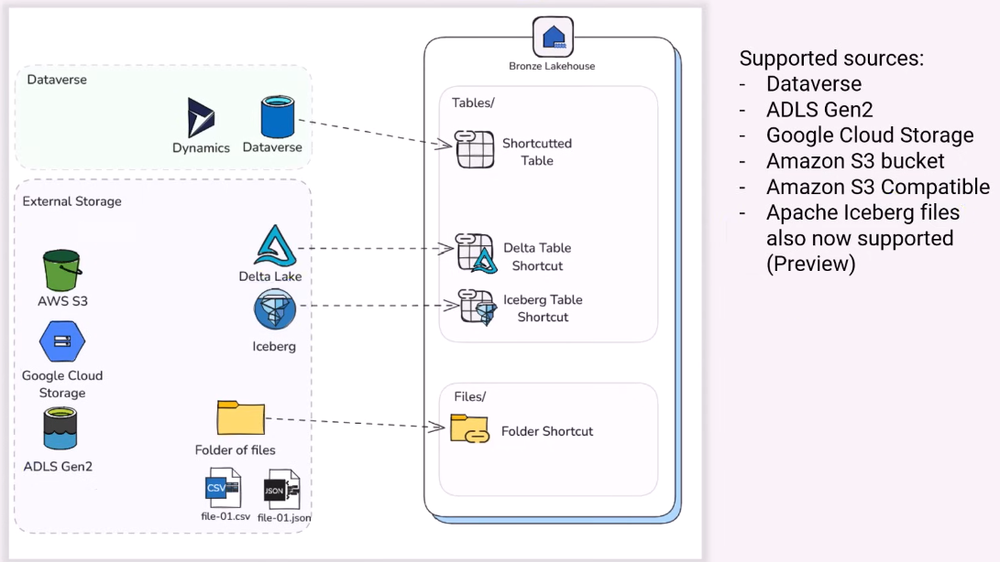

> Some rules about shortcut caching:

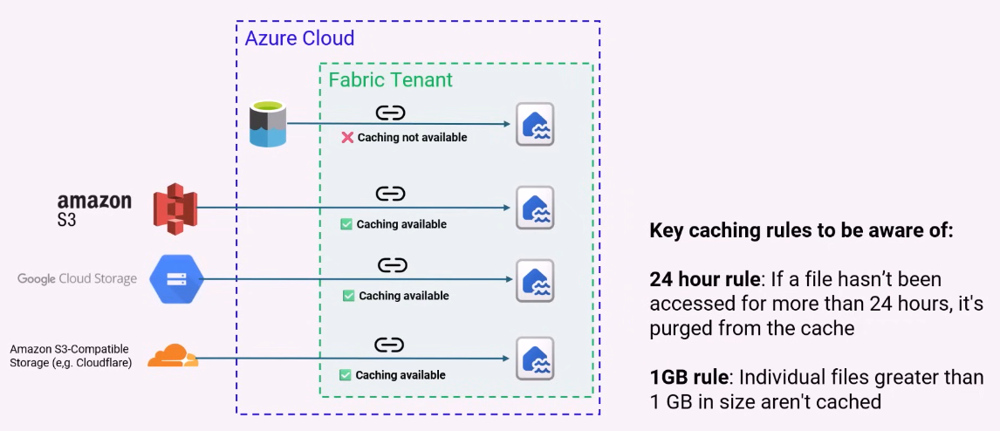

--

### Implement mirroring

`Database Mirroring`: is a Fabric feature, which allows you to **"Mirror"** a supported database into Fabric, in near-real-time, without the need for ETL (no need for complicated pipeline). After that, you can use Fabric tools directly on mirrored data.

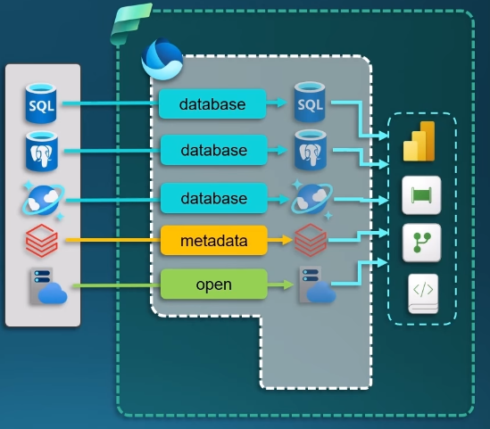

3 types of Mirroring:

- `Database Mirroring`

  - replicate databases and tables into OneLake
  - mirrored data is written to Delta tables
  - keep data fresh with near real-time sync
  - mirror is readonly
  - changes in the source are automatically reflected in the mirror
  - table data, schema and basic metadata gets mirrored
  - currently supported for: Cosmos DB, SQL DB, Snowflake, SQL managed instance, Azure database for PostgreSQL flexible server

- `Metadata Mirroring` _(in Azure Databricks)_

  - syncs only metadata and uses shortcuts to access the data
  - only mirrors metadata, without copying the actual data
  - is made possible by having data in Azure Data Blob Storage in Delta parquet format already
  - use shortcuts to point to the data, but uses metatdata to display data in more easily usable way
  - source datastore metadata and schema get mirrored

- `Open mirroring`
  - enables any application to write change data directly into a mirrored database in Fabric.
  - allow you to mirror data from any data store or souce system
  - use CDC to track insert, delete and update
  - CDC can be written as CSV or Parquet
  - works as database mirroring but CDC logic is not provided out of the box

A mirrored database can be created in `Workspace`, simply click `"New item"` and then search for `Mirror`.

--
### Ingest data by using pipelines
Check [part 1](../1.ImplementAndManageAnalyticsSolution/). 

Also check on Microsoft Learning modules for DP-700. 

--
### Transform data by using PySpark, SQL, and KQL
#### Get started with T-SQL 
- Section 1: `Table creation / Data ingestion`
  1. CREATE TABLE
  2. COPY INTO ... FROM ...
  3. SELECT INTO FROM
  4. INSERT INTO FROM
  5. CREATE TABLE AS SELECT  
- Section 2: `JOINS`
  - Left join
  - Inner join
  - Full outer join
- Section 3: `SCD`
- Section 4: `Granular security`
  - Steps to implement row security: create schema -> create function -> create security policy  
  - grant access/rights to user 
  - apply masking 

#### Get started with PySpark 
- Notebook fundamentals 
  - notebookutils: .fs.mv() | .notebook.runMultiple() | .credentials.getSecret()
- Table creation
- Data cleaning & transformation 
- Loading methods 

#### Get started with KQL 
- `take/limit`:
```
MyTable
| take 10
```
- `project` (select columns)
```
| project ColumnA, ColumnB
```

- `project-rename`
```
| project-rename NewName = OldName
```

- `where`
```
| where Temperature > 50
| where Status == "Failed"
```

- `in/!in`
```
| where Country in ("US", "UK")
```

- `summarize` *(similar to groupby)*: Produces a table that aggregates the content of the input table.
```
| summarize Total = count() by Country
```

- `arg_max / arg_min`: Finds a row in the table that maximizes the specified expression. The following example finds the maximum latitude of a storm event in each state.
```
StormEvents 
| summarize arg_max(BeginLat, BeginLocation) by State
```

- `joins`: inner join, left outer join, ...
```
T1
| join T2 on UserId

T1
| join kind=leftouter T2 on UserId
```

- `union`: union tables 
- `extend` (add new columns)
```
| extend FullName = FirstName + " " + LastName
```

- `case` (if/else)
```
| extend Category = case(
      Score > 90, "High",
      Score > 70, "Medium",
      "Low"
  )
```

- `materialize` (for reuse)
```
let Base = materialize(
    MyTable
    | where Timestamp > ago(1d)
);
Base
| summarize count() by Country
```

--
### Denormalize data
`denormalization` is the term used to define where precomputed redundant data exists.
  - use merge, join 
  - `explode` arrays 
  - create surrogate keys 
  ```py
  from pyspark.sql.window import Window
  from pyspark.sql.functions import row_number

  df = df.withColumn("sk", row_number().over(Window.orderBy("id")))
  ```

--
### Group and aggregate data
- Focus on aggregation from PySpark, SQL and KQL syntax.
```py
# sql 
SELECT region, category, SUM(sales) AS total_sales
FROM sales
GROUP BY region, category
HAVING SUM(sales) > 10000;

# pyspark
df.groupBy("product").agg(
    sum("sales").alias("total_sales"),
    avg("sales").alias("avg_sales")
)

# kql
Events
| summarize avg(Duration), count() by UserId
```


--
### Handle duplicate, missing, and late-arriving data
- To handle duplicates:
```py
# pyspark
df_clean = df.dropDuplicates(["id"])

# use a unique checkpoint location to ensure no duplicates are returned

# OR use MERGE to dedupe data in target table

# kql
Events | distinct UserId, EventName # distinct 

```
- To handle missing data:
```py
# drop missing data 
df_clean = df.dropna()

# impute missing values 
df.fillna({"age": 0, "city": "Unknown"})

# kql
Events | extend Country = coalesce(Country, "Unknown")
Events | where isnotempty(UserId) # filter missing rows

```

- To handle late-arriving data:
```py
# define watermark
df = df.withWatermark("event_time", "10 minutes")

# late data handling with aggregation
df.groupBy(
    F.window("event_time", "5 minutes")
).count()

```

## Ingest and transform streaming data
### Choose an appropriate streaming engine (Spark structured streaming vs Eventstream)

| Category | Spark Structured Streaming | Eventstream |
|---------|-----------------------------|-------------|
| **Engine Type** | Distributed Spark-based streaming computation engine | Managed, low-code, real-time ingestion & processing engine |
| **Typical Users** | Data engineers, developers | Citizen developers, analysts, data engineers |
| **Latency** | Low to medium latency (seconds) | Very low latency (sub-second to seconds) |
| **Scalability** | High; autoscaling Spark clusters | Very high; serverless and auto-scaled |
| **Programming Model** | Code-first (PySpark / Scala) | No-code / low-code visual UI |
| **Primary Use Case** | Complex transformations, machine learning, joins, windowing, stateful processing | High-throughput ingestion, routing, filtering, lightweight transformations |
| **Advanced Transformations** | Fully supported (joins, aggregations, stateful ops, custom ML logic) | Limited (filters, projections, simple aggregates) |
| **Windowing Support** | Complete support: tumbling, sliding, session windows | Built-in tumbling, sliding, session windows in visual UI |
| **Schema Enforcement** | Strong schema ops via Spark + Delta | Strong schema ops with automatic schema inference |
| **Output Targets** | Lakehouse, Delta Tables, Warehouse, Kusto, Kafka, etc. | Lakehouse, KQL Database, Real-Time Hub, Warehouse, Eventstreams |
| **Input Sources** | Eventstream, Kafka, ADLS, Lakehouse, Delta, Kinesis, custom connectors | Event Hubs, Kafka, IoT Hub, Kusto, Webhooks, more |
| **Deduplication** | Custom logic via Spark (`dropDuplicates`, watermarking) | Built-in dedup options |
| **Late-Arriving Data Handling** | Watermarking + stateful windowing | Timestamp-based policies + windowing |
| **Handling Missing Data** | Full Spark DataFrame operations (impute, filter, fill, etc.) | Limited to simple filtering or routing |
| **Error Handling** | Custom error handling, DLQs with Delta tables | Built-in error routing with DLQ |
| **Operational Complexity** | Higher (clusters, code, dependencies) | Very low (fully managed, configuration only) |
| **CI/CD Integration** | Yes, via notebooks, pipelines, Git | Yes, via Eventstream definitions + JSON export |
| **Learning Curve** | Moderate to high | Very low |
| **Cost Model** | Based on Spark compute (capacity units) | Serverless consumption-based |
| **Best For** | Real-time ETL, ML scoring, complex business logic, advanced stateful operations | High-throughput ingestion, real-time dashboards, data routing, low-code streaming apps |
| **Not Ideal For** | Simple routing-only pipelines | Heavy business logic or ML pipelines |


--
- Choose between native storage, mirrored storage, or shortcuts in Real-Time Intelligence

-- 
### Process data by using eventstreams
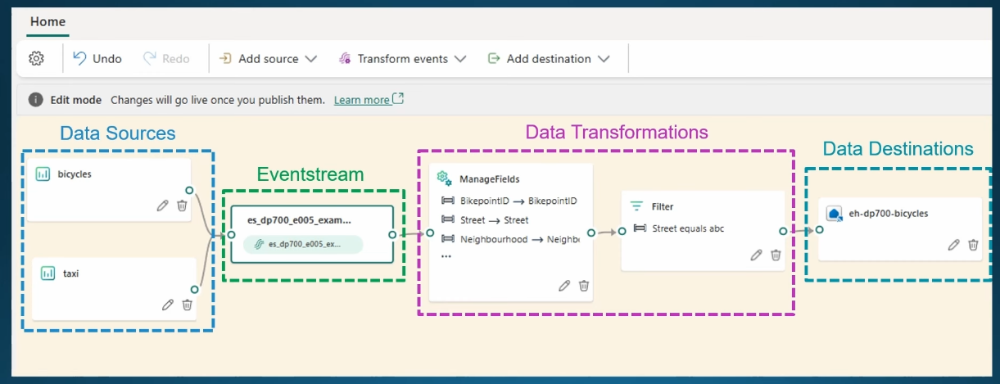

There are different types of sources used in `Eventstream`. We can have multiple sources in Evenstream.
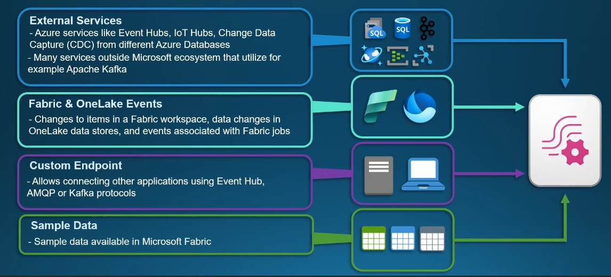

`Evenstream Data Transformation`:

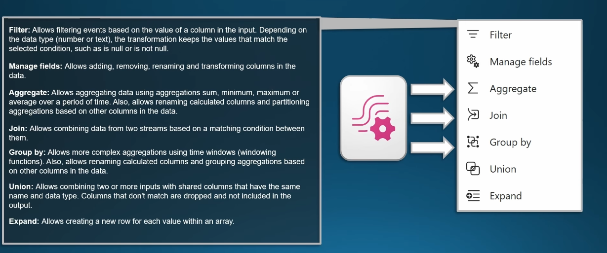

`Eventstream Data Destination`:
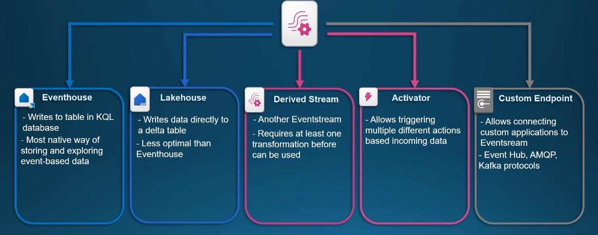

In `Eventstream` cell, we have these properties:
  - Endorsement
  - Tags
  - Retention: defnes the time that Eventstream keeps the messages that are sent to it
  - Event throughput: adjust the throughput specified for this eventstream. **Remember that:** more throughput = more capacity consumption.


#### Eventhouse 
- is a **data store** optimized for a realtime data and analytics
- logical grouping of KQL databases - which is optimized for fast event ingestion.
- ideal for working with streaming data, telemetry, clickstreams, and IoT events
- KQL is the primary way to query KQL databases
- Strengths:
  - realtime streaming and telemetry data ingestion
  - low-latency analytics with fast query responses 
  - semi-structured or event-based data 
  - highly scalable to handle massive data volumes (millions of events/second)

- Weaknesses:
  - NOT designed for traditional relational data modelling 
  - transaction support is limited compared to relational engines
  - suitable for short-term data (rather than multi-year archives)
  - need to master KQL 

- `KQL Queryset`: a Fabric item that organizes multiple saved KQL queries 
- `KQL database`
- `Shortcuts`: query external data without duplicating it inside Eventhouse
- `Materialized View in KQL`: precomputed query results stored as managed tables | automatically updated as new data is ingested. Note: some important properties to remember include `backfill`, `effectiveDateTime`
```py
# Backfills all past data.
# Aggregates per day per event type: counts, sum of values, etc.
# Allows easy querying per “effective date” (i.e. the day) — so your downstream consumers (dashboards) can filter by date.
.create async materialized-view with (backfill=true) DailyEventStats on table Events
{
    Events
    | extend EventDate = bin(EventTime, 1d)
    | where EventDate <= now()  // optional filter to exclude future-dated events
    | summarize
        CountEvents = count(),
        SumValue = sum(Value),
        MaxValue = max(Value),
        MinValue = min(Value)
      by EventDate, EventType
}

- async: ensures backfill runs in the background (useful for large tables). 
- with (backfill=true): requests that existing data are processed, not only new events. 

After creation, DailyEventStats will hold daily aggregated stats for all historic + new data going forward.

# Then you can query 
DailyEventStats
| where EventDate between (datetime(2025-11-01) .. datetime(2025-11-27))
| order by EventDate desc

```


--
### Process data by using Spark structured streaming
- Know how to **read files from stream**
```py
df = (spark.readStream
        .format("cloudFiles")
        .option("cloudFiles.format", "json")
        .option("cloudFiles.inferSchema", "true")
        .load("/lakehouse/myws/Files/sensor_raw/"))
```

- Know how to **write to a Delta Table**
```py
(df.writeStream
   .format("delta")
   .option("checkpointLocation", "/lakehouse/myws/checkpoints/sensordata")
   .outputMode("append") # append, complete, update
   .start("/lakehouse/myws/Tables/sensordata"))
``` 

- Know how to **set the trigger for stream query**.
```py
# Trigger the query for execution every 5 seconds
df.writeStream.trigger(processingTime='5 seconds')
df.writeStream.trigger(continuous='5 seconds')
```

- Know how to **checkpointing** *(for Lakehouse Streaming)*
```py
.option("checkpointLocation", "/lakehouse/myws/checkpoints/sensor_ckpt")
```

- Know how to **watermarking** *(late-arriving data control)*. *Note*: A watermark tracks a point in time before which we assume no more late data is going to arrive.
```py
df_with_watermark = df.withWatermark("event_time", "2 hours")
```
- Know some basic transformations
  - `Filter`
  ```py
  df_filtered = df.filter(df.value > 50)
  ```

  - `select` and `cast`
  ```py
  from pyspark.sql.functions import col

  df = df.select(
      col("id"),
      col("temperature").cast("double")
  )
  ```

  - `string` manipulation
  ```py
  from pyspark.sql.functions import split

  df = df.withColumn("country", split(col("location"), "/")[0])
  ```

  - `aggregation`
  ```py
  from pyspark.sql.functions import window, count

  agg = (df
          .withWatermark("event_time", "10 minutes")
          .groupBy(window("event_time", "5 minutes"), "sensor_id")
          .agg(count("*").alias("count")))
  ```

  - handling `schema evolution`
  ```py
  .option("mergeSchema", "true") # auto 

  .option("cloudFiles.schemaEvolutionMode", "addNewColumns") # streaming ingestion
  ```

  - some built-in `time` functions
  ```py
  current_timestamp()
  to_timestamp()
  date_trunc()
  window()
  ```


--
### Process data by using KQL
Check [Get started with KQL](#get-started-with-kql) above.


--
### Create windowing functions
`Groupby` and `Window` function are used to group events over time. 
- `Tumbling window`
  - Fixed-size, non-overlapping, contiguous time intervals. 
  - Each event belongs to exactly one tumbling window. 
  - At the end of each window, you emit an aggregate (count, sum, avg, etc.).
  - **Use case:** Suppose you have sensor readings from IoT devices reporting temperature every second. You want to compute the average temperature every 1 minute **(fixed time intervals)**.


- `Snapshot window` *(less common in Fabric scenario)*
  - group together events that arrive at the same timestamp 
  - no time duration is defined *(triggered when events arrive)*
  - **Use case:** detecting multiple orders placed at the same exact timestamp

- `Hopping window`
  - Windows of fixed length, but **overlap**, because each window “hops” forward by a hop size that can be smaller than the window size. 
  - Events can belong to **multiple windows**. 
  - You specify three parameters: time unit, window size, and hop size (optionally an offset).
  - **Use case:** Imagine you are processing click-stream data from a website, and you want to compute the number of clicks in the *last 5 minutes*, but update that count *every 1 minute*. \
  Here, each window is 5 minutes long, but because of the 1-minute hop, you'll get overlapping windows, so the count will reflect the “rolling” clicks.

- `Sliding window`
  - considers all possible windows of the specified length, but in practice, it only emits when the **content changes** (i.e. when an event enters or exits the window).
  - dynamic: you don’t wait for a fixed schedule; the window result updates whenever the window’s membership changes.
  - **Use case:** Suppose you're monitoring login attempts to a system for anomaly detection. You want to detect if there are **more than 10 login attempts in any 2-minute sliding interval**. \
  This will emit a result as soon as the count in any 2-minute sliding interval crosses the threshold, not just at fixed boundaries.

- `Session window`
  - group events based on “activity session,” not fixed time intervals.
  - **use case:** Imagine you're tracking user activity on a website, and you want to compute **how long each “session” lasts**. A session is defined as a series of user actions, but if there’s more than 5 minutes of inactivity, the session is considered ended. Assume also no session should exceed 1 hour. \
  If a user doesn’t produce any event for **5 minutes**, the window “closes” and a session record is emitted. But if the session keeps being active, it will keep extending until it hits **60 minutes**, then closes. 

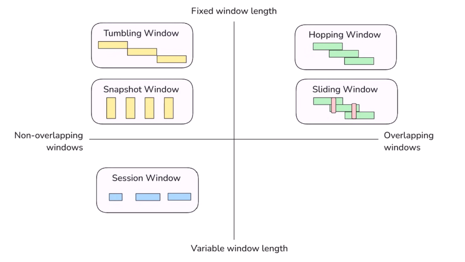

```
Summary:
- Tumbling → periodic summaries
- Hopping → rolling metrics with overlap
- Sliding → continuous detection / anomaly when content changes
- Session → user or device activity sessions

```

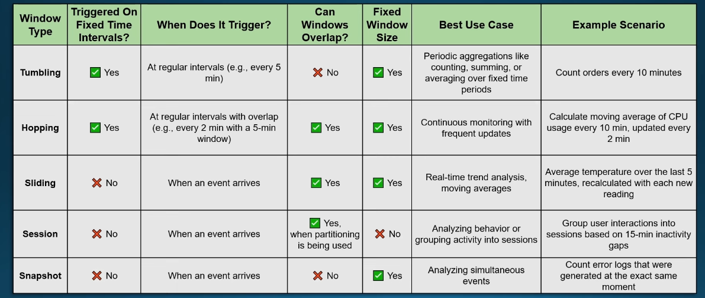


--
# A note on some decision choices 
- Choosing `DE tool`

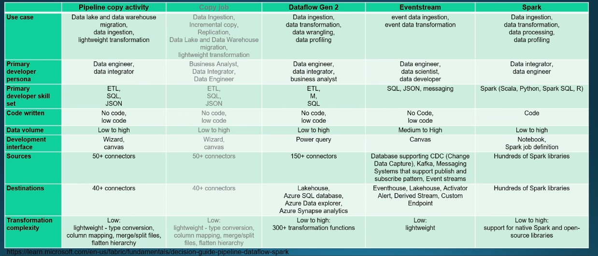

- Choosing `data store`

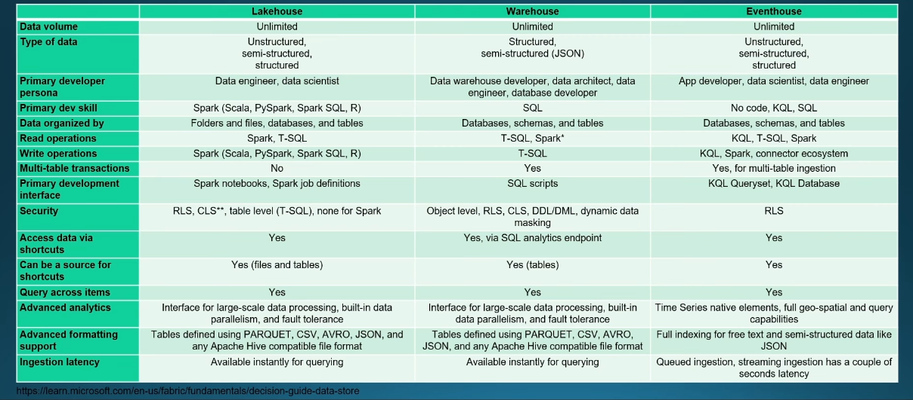