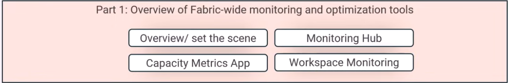
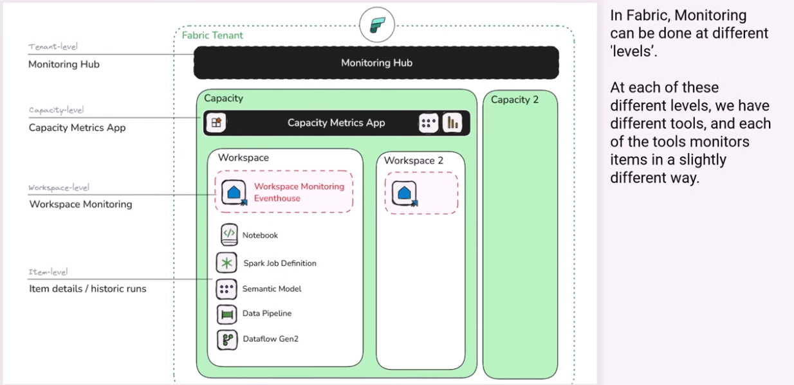
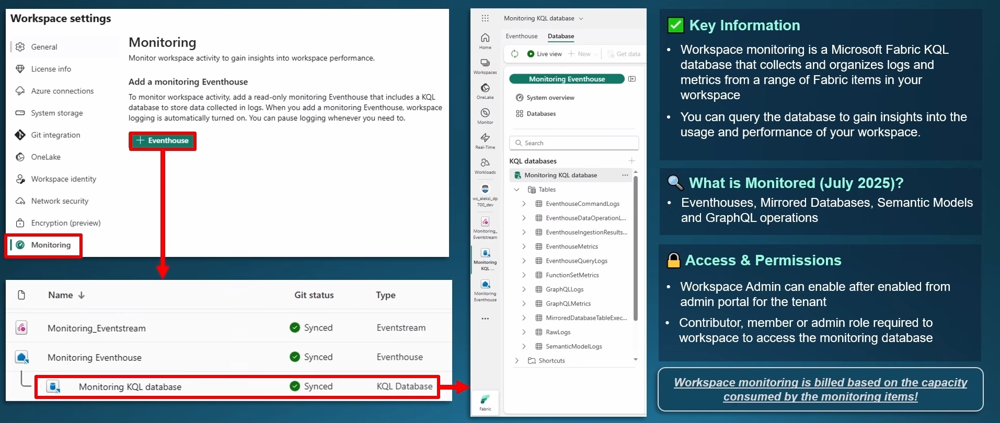
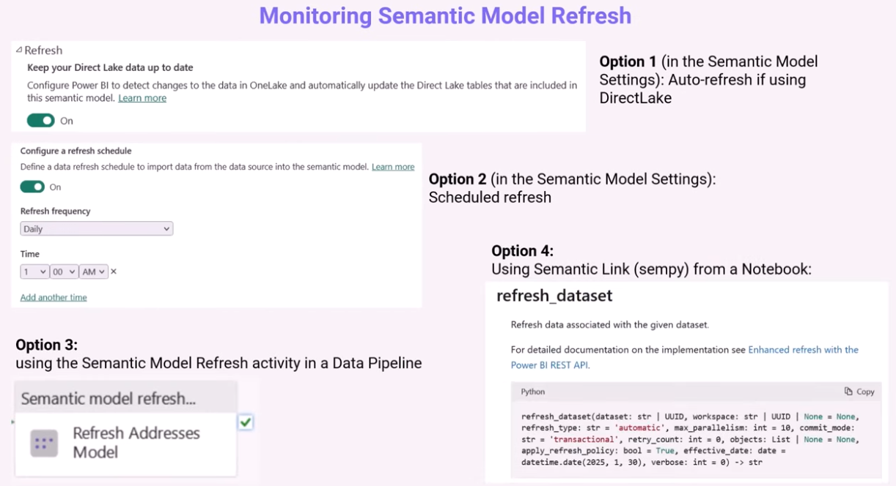
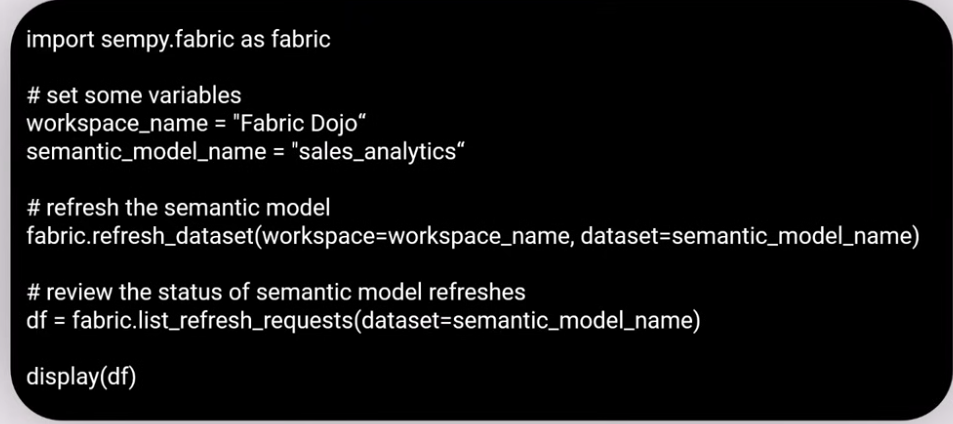
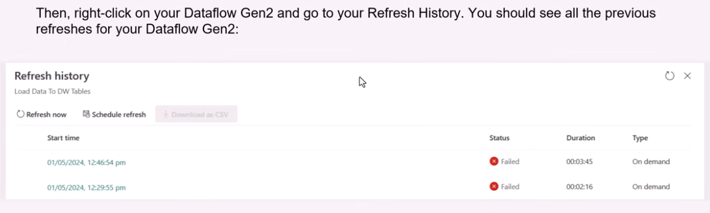
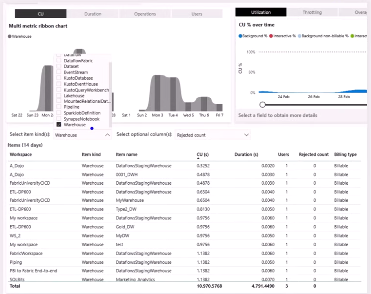
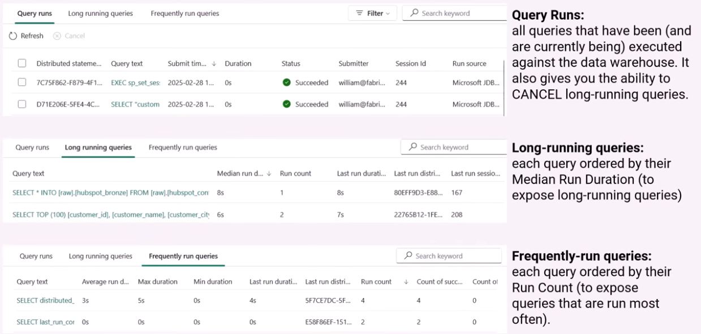
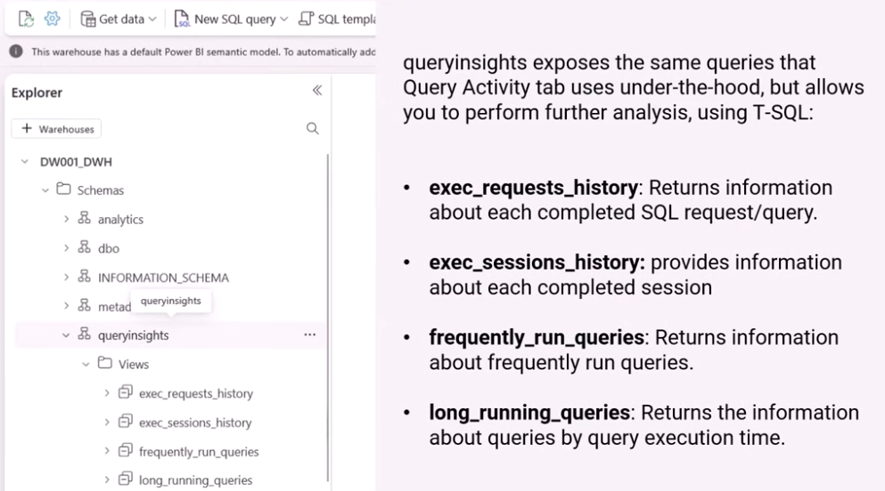
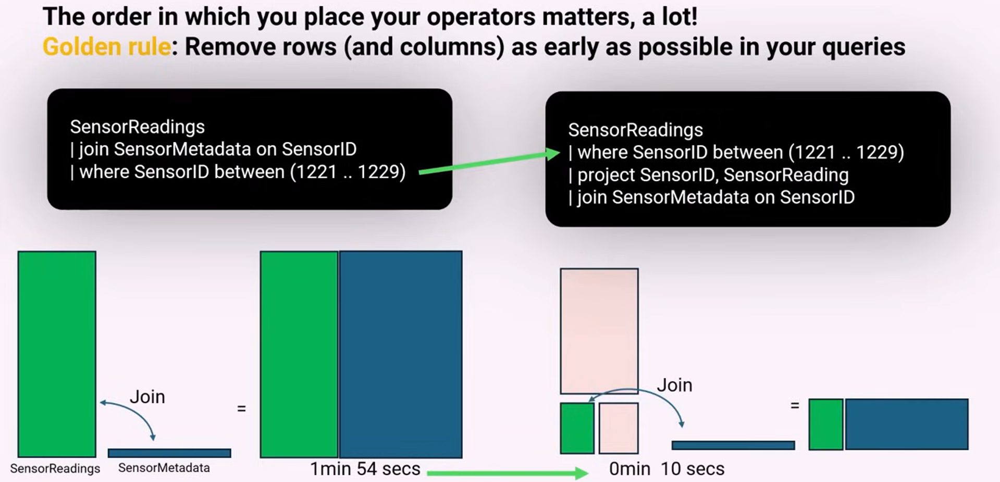

# Monitor and optimize an analytics solution (30–35%)

## Monitor Fabric items
Things related to this section


An overview:


`Monitoring hub`: track the status of current and historic runs of Fabric items.
  - run status
  - look for errors/failures 
  - navigate to failed item for detailed debugging 
  - supported items: data pipelines, dataflow gen 2, notebooks, spark job definition, semantic model refreshes

`Capacity Metrics App`: is a powerbi semantic model that can be installed in your Fabric Capacity -> show capacity consumption for billable actions 

`Workspace monitoring`: if it is enabled, you will get an Eventhouse provisioned for you, to track workspace-level activities.
  - Supported items: GraphQL operations, Eventhouse, Mirrored database, Semantic Models


-- 
### Monitor data ingestion and transformation
Check Microsoft Learn - the DP-700 learning path for more info. 

--
### Monitor semantic model refresh


- Using Semantic Link:


-- 
### Configure alerts
To configure alerts, we can use `Activators` in Fabric. When an event happens, `Activator` can trigger actions (source = **event** and action = **rule**). Activator treats all data sources as **stream of events**. 

- 3 types of `rules` in Activator:
  - `Event-based rules`: triggered by individual events as they occur. E.g., send an email when there is no coming data in 10 minutes.
  - `Object event rules`: triggered when events are added to a specific object instance. E.g., Send an email when there is not incoming data for Vienna in 10 minutes 
  - `Object property rule`: triggered based on the current state or properties of an object instance. E.g., Send an email when average temperature exceeds 15.5 degrees in Vienna. 


## Identify and resolve errors

### Identify and resolve pipeline errors
- Monitor pipelines in **Monitoring Hub** 
- Inspecting the inputs/outputs via error message 
- Pipeline activities: `retry`
- `Copy data` activity for logging and optimization 
  - **Intelligent throughput optimization**: cpu assigned to task (4-256)
  - **Degree of copy parallelism**: parallelize the Copy 
  - **Fault tolerance**: skip rows or files that cannot be successfully copied 
  - **Enable logging**: write detailed logs to Azure blob
  - **Enable staging**: use Workspace staging, or external blob as staging environment

--
### Identify and resolve dataflow errors


-- 
### Identify and resolve notebook errors
1. Spark monitoring hub: find the duration, write/read bytes in this monitoring hub
2. Spark Monitor Run series: semantics about the performance of your Spark notebook
3. Spark History Server (deep dive): deep dive and optimization of Spark jobs -> access logs, query plans and more.  
--
### Identify and resolve eventhouse errors
use `Eventhouse Capacity Consumption Monitoring`

When monitoring Eventhouse, you can query the following tables:
  - `Command logs`: list of commands run on an Eventhouse KQL database
  - `Data operation logs`: list of data operations of an Eventhouse KQL database
  - `Ingestion results logs`: list of results from data ingestions to an Eventhouse KQL database
  - `Metrics`: details of ingestion, materialized views, and continuous exports of an Eventhouse KQL database
  - `Query logs`: list of queries run on an Eventhouse KQL database

--

### Identify and resolve eventstream errors
**Data insights**: 
  - `IncomingMessages(Count)`: the number of events or messages sent to an eventstream over a specific period
  - `OutgoingMessages(Count)`: the number of events or messages outflow from an eventstream over a specific period
  - `Incoming Bytes (Bytes)`: Incoming bytes for an eventstream over a specific period
  - `Outgoing Bytes (Bytes)`: Outgoing bytes for an event stream over a specific period

There is Eventstream monitoring - `Runtime logs`
  - created by Eventstream engine 
  - categorized as: **warning**, **error**, or **information**

--
### Identify and resolve T-SQL errors
Check syntax, permission, data-type conversion, constraints when creating/deleting tables (foreign keys violation). 

## Optimize performance

### Optimize a lakehouse table
Reference [below](#optimize-spark-performance-and-query-performance).

--
### Optimize a pipeline
Things to try to optimize in Dataflow Gen2:
  - `Fast Copy` (depending on the source)
  - `Enable Staging`: dataflow is extracted from the data source, and write directly to staging warehouse/lakehouse 
  - Try one query per Dataflow 
  - If use too much capacity, try Dataflow gen 1 (consume less)
  - Try `Copy Job` (consume less capacity)
  - Migrate to Notebook or Data Pipeline (save capacity)

--
### Optimize a data warehouse
`Data warehouse Capacity Consumption`: can be used to get a high-level picture of capacity utilization in your Data Warehouse 



`Query Activity Tab`:

 


`query insights schema`



Optimization in Data Warehouse
`VOrder`: is a process that is performed when Fabric writes a new Parquet file, the output is a highly optimized parquet file to make reads really quick. 

--
### Optimize eventstreams and eventhouses
- `KQL query optimization`:


--
### Optimize Spark performance and query performance
- run the `maintenance command`: which will run the **OPTIMIZE** command in Spark to compact and rewrite Delta Parquet files. Optionally, run **VACUUM** command. 
- for reading in tables (gold) -> turn VOrder on 
- for writing in tables (sivler) -> turn VOrder off
- `partitioning data` (as Spark is a distributed engine)
  ```py
  df.write
    .mode("overwrite")
    .format("delta")
    .partitionBy("year", "month")
    .save(...)
  ```
