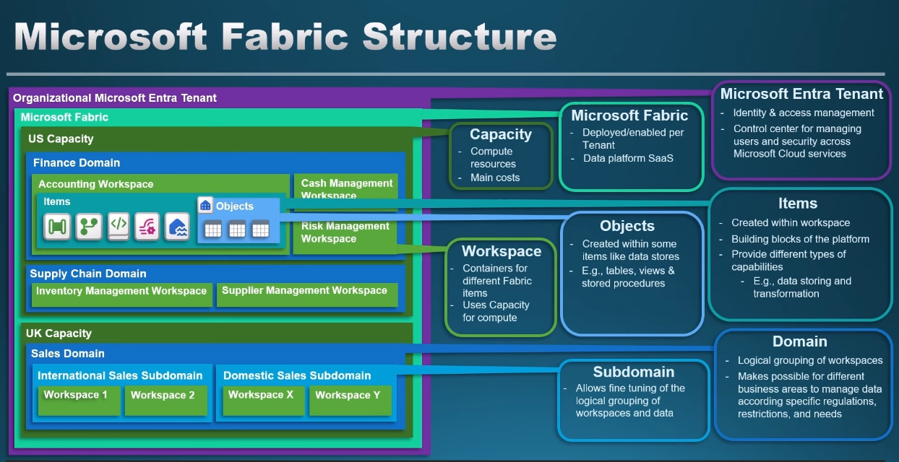

# About

This is the guideline for the exam [Microsoft Certified: Fabric Data Engineer Associate](https://learn.microsoft.com/en-us/credentials/certifications/fabric-data-engineer-associate/?practice-assessment-type=certification).

This README.md file will mostly reveal all necessary things to cope with the exam.

# Structure of the exam

## Skills measured as of April 21, 2025

As a candidate for this exam, you should have subject matter expertise with data loading patterns, data architectures, and orchestration processes. \
Your responsibilities for this role include:

- Ingesting and transforming data.
- Securing and managing an analytics solution.
- Monitoring and optimizing an analytics solution.

You should be skilled at manipulating and transforming data by using Structured Query Language (SQL), PySpark, and Kusto Query Language (KQL).

## Skills at a glance

### Implement and manage an analytics solution (30–35%)

#### Configure Microsoft Fabric workspace settings

- Configure Spark workspace settings
- Configure domain workspace settings
- Configure OneLake workspace settings
- Configure data workflow workspace settings

#### Implement lifecycle management in Fabric

- Configure version control
- Implement database projects
- Create and configure deployment pipelines

#### Configure security and governance

- Implement workspace-level access controls
- Implement item-level access controls
- Implement row-level, column-level, object-level, and folder/file-level access controls
- Implement dynamic data masking
- Apply sensitivity labels to items
- Endorse items
- Implement and use workspace logging

#### Orchestrate processes

- Choose between a pipeline and a notebook
- Design and implement schedules and event-based triggers
- Implement orchestration patterns with notebooks and pipelines, including parameters and dynamic expressions

### Ingest and transform data (30–35%)

#### Design and implement loading patterns

- Design and implement full and incremental data loads
- Prepare data for loading into a dimensional model
- Design and implement a loading pattern for streaming data

#### Ingest and transform batch data

- Choose an appropriate data store
- Choose between dataflows, notebooks, KQL, and T-SQL for data transformation
- Create and manage shortcuts to data
- Implement mirroring
- Ingest data by using pipelines
- Transform data by using PySpark, SQL, and KQL
- Denormalize data
- Group and aggregate data
- Handle duplicate, missing, and late-arriving data

#### Ingest and transform streaming data

- Choose an appropriate streaming engine
- Choose between native storage, mirrored storage, or shortcuts in Real-Time Intelligence
- Process data by using eventstreams
- Process data by using Spark structured streaming
- Process data by using KQL
- Create windowing functions

### Monitor and optimize an analytics solution (30–35%)

#### Monitor Fabric items

- Monitor data ingestion
- Monitor data transformation
- Monitor semantic model refresh
- Configure alerts

#### Identify and resolve errors

- Identify and resolve pipeline errors
- Identify and resolve dataflow errors
- Identify and resolve notebook errors
- Identify and resolve eventhouse errors
- Identify and resolve eventstream errors
- Identify and resolve T-SQL errors

#### Optimize performance

- Optimize a lakehouse table
- Optimize a pipeline
- Optimize a data warehouse
- Optimize eventstreams and eventhouses
- Optimize Spark performance
- Optimize query performance

## Some reviews on Reddit about the exam
### 1.
First Attempt: 540 – Relied too much on practice tests, lacked depth.
Second Attempt: 912 – Big change after:

Re-read MS Learn modules thoroughly.

Practiced SQL, KQL, PySpark daily.

Watched Aleksi’s videos again for better clarity.

Did Fabric hands-on labs to get real experience.
Actual Exam Experience
Total Questions: 54

Exam Pattern:

Part 1 – Case Study (10 Qs, can’t go back later, spend only 20 mins here)

Part 2 – 44 Questions ranging from easy → medium → difficult.

Tips:

Use MS Learn for last-min reference if you know exactly where to look.

Manage time carefully: Don’t spend too long on similar looking answers or on MS learn.

Case Study answers require quick comprehension.

### 2. 
Regarding what resources I used to study:

I studied mostly watching youtube videos. shoutout to Aleksi Partanen and Will. I watched both series and I find that it was worth my time to watch both. They both cover all the topics but explain things differently and in different order. Some topics were easier for me to understand on one compared to the other.

I did have a Fabric Environment but to be honest I did not follow along on the videos. It feels repetitive to me. I just did basic navigation and creation of objects and perhaps real time intelligence since I was not very familiar with.

What I did find useful for practicing was the Microsoft learn modules. I left this at the end and didn't even have time to finish it. Most people disregard it as not covering enough ground which might be true but it's great for practice and they do mention stuff you don't see elsewhere.

Always relied on the documentation for topics I felt there was more to it i.e. spark settings.

I did the official practice assessments and certiace practice questions. This helped me see what knowledge I was still lacking but don´t expect to have similar questions in the exam.

Some advice:

Time management is important, I used Will's advice on allocating time between case study, regular questions, and reviewing answers.

Use the Sandbox, current practice assessments do not reflect the different type of questions you´ll get.

There are very specific syntax/code related questions, although not many. The level of detail surprised me. MS Learn helped me in some cases.

MS Learn helped me with a few questions. You will not get an index like the current documentation has. I would use the search bar to get to one topic and that topic in some cases had the link to the thing I was looking for. In some cases the search bar didn't return anything useful at all. I only started using while I was reviewing answers.

### 3. 
Too many T-SQL questions

# Microsoft Fabric Structure 

