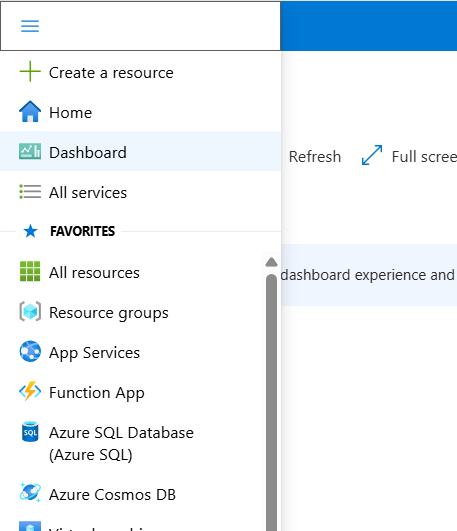
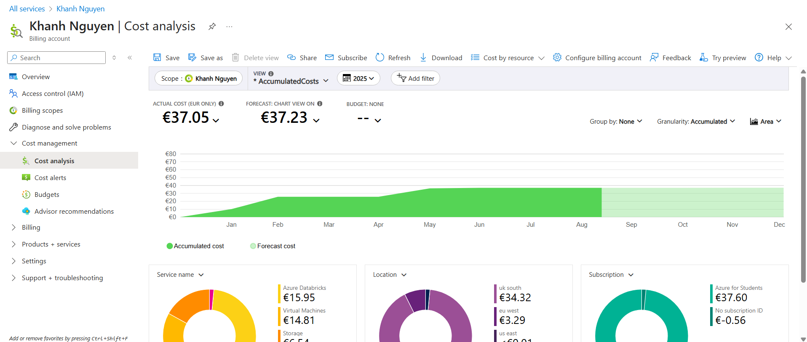
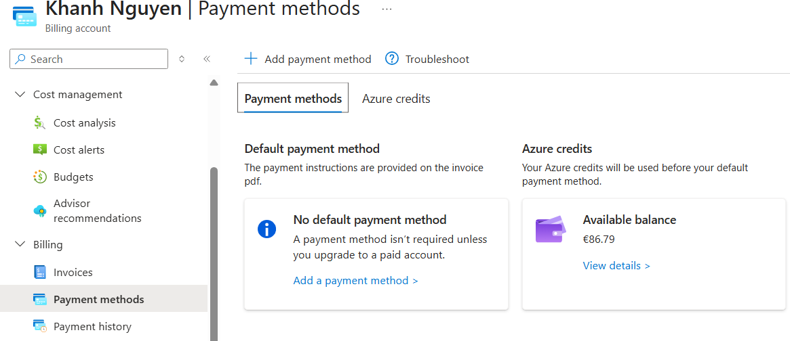
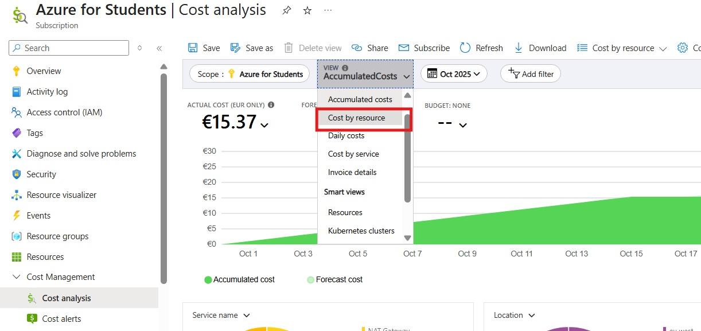
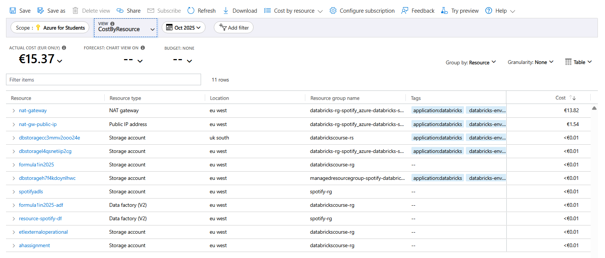
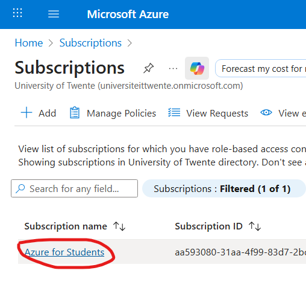
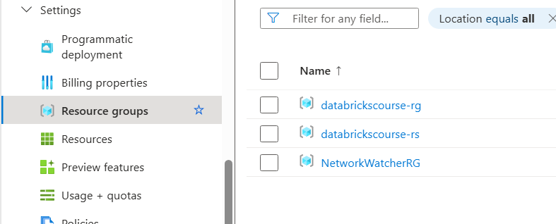
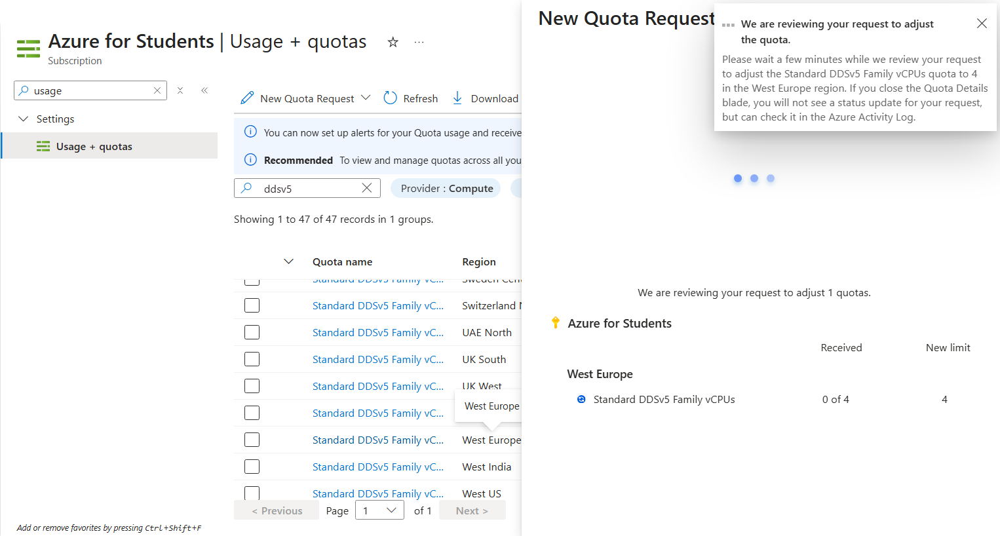
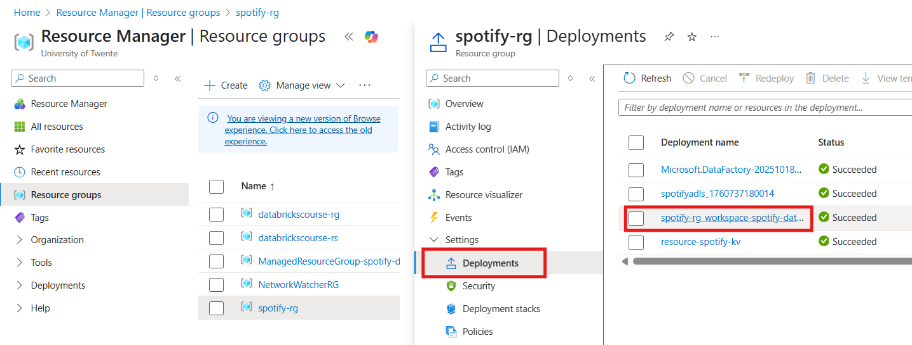
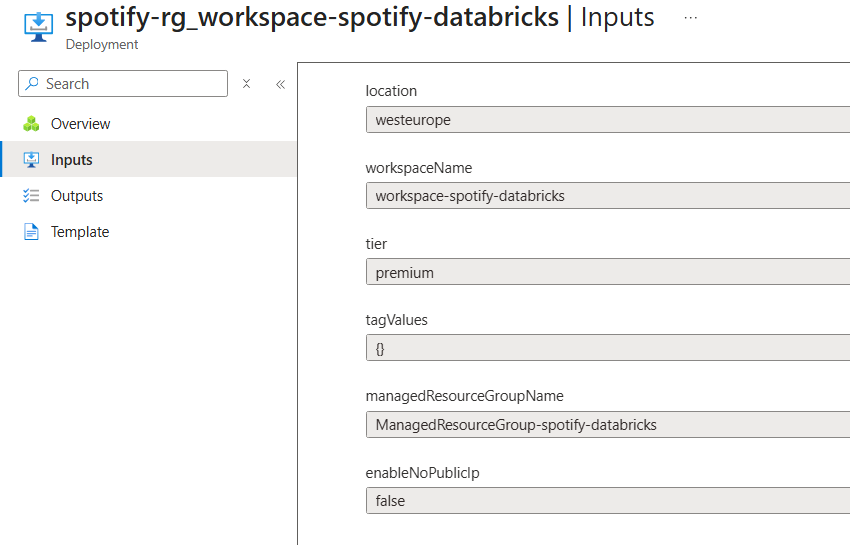

# About

This README.md file will show Microsoft Azure Portal in general, and how to set up/custom our own Microsoft Azure Portal.

# Overview

To make it simple, I usually **pin** all the often-used services to the dashboard for easy management.

# Cost management

## Cost analysis

Analyse the accumulated cost

To view the available balance, go to `Payment method`

## View the cost by resource

Choose view `CostByResource`

# Resources

To check the used resources (group), go to subscription -> click on the current subscription -> `Resource groups` / `Resources`.

# Increase the quota

If you cannot create a cluster with specific quota configurations due to limits in your region, you can try `requesting the quota`: Go to Azure Portal -> `Subscriptions` -> click on your subscription -> `Settings` -> `Usage + Quotas`

With this, you can also view the **available quotas** of _each region_.

# Check Databricks configuration

It may happen that you accidentally deploy Azure Databricks workspace with **Secure Cluster Connectivity (No Public IP)**, thus, Azure automatically creates a NAT Gateway, which incurs additional cost!

To check Databricks configuration (with **ARM template**), from home, choose `Resource group` on the left menu -> go to the resource group that contains Databricks service -> choose `Deployments` on the left tab -> choose the Databricks service.

Then, click on the `Inputs` to view the ARM template. Here, you can see the option `enableNoPublicIp` is set to **false**, which means **Secure Cluster Connectivity** is not enabled.

